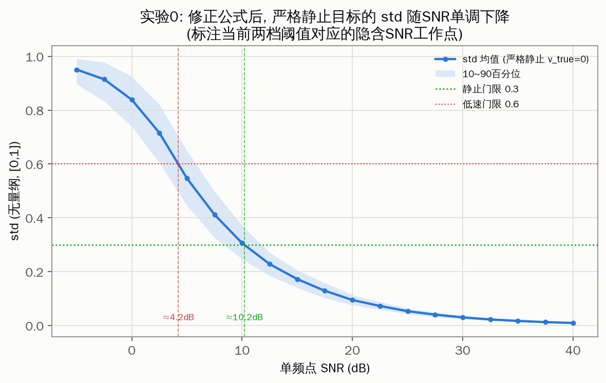
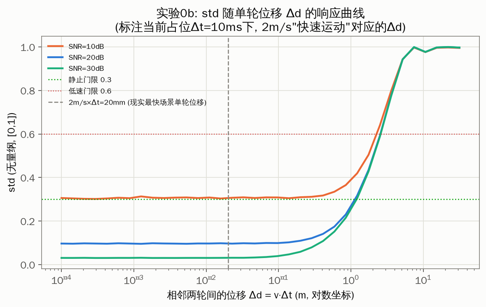
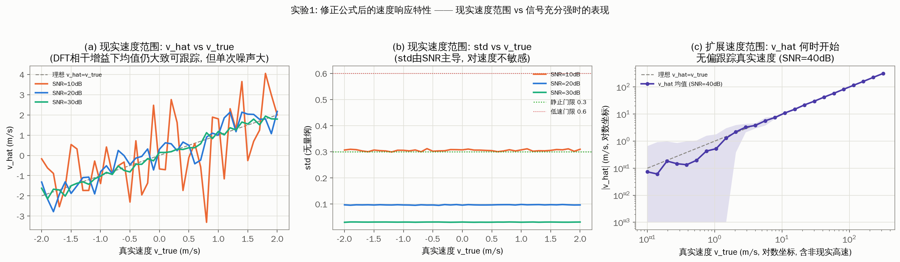
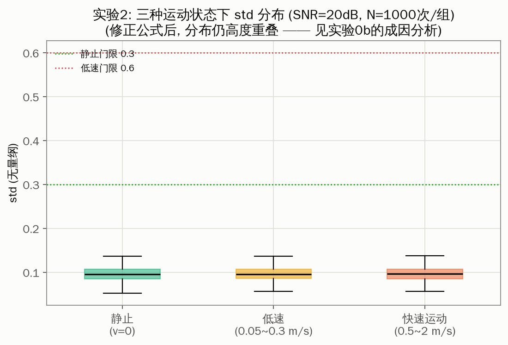
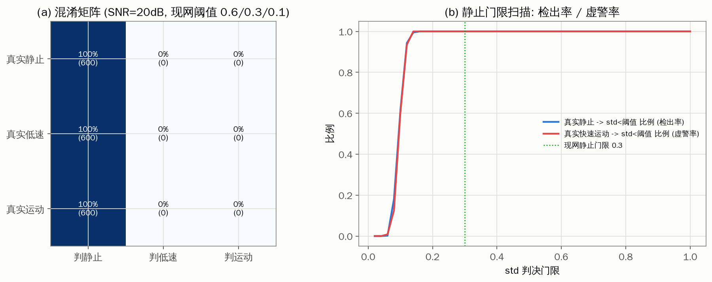
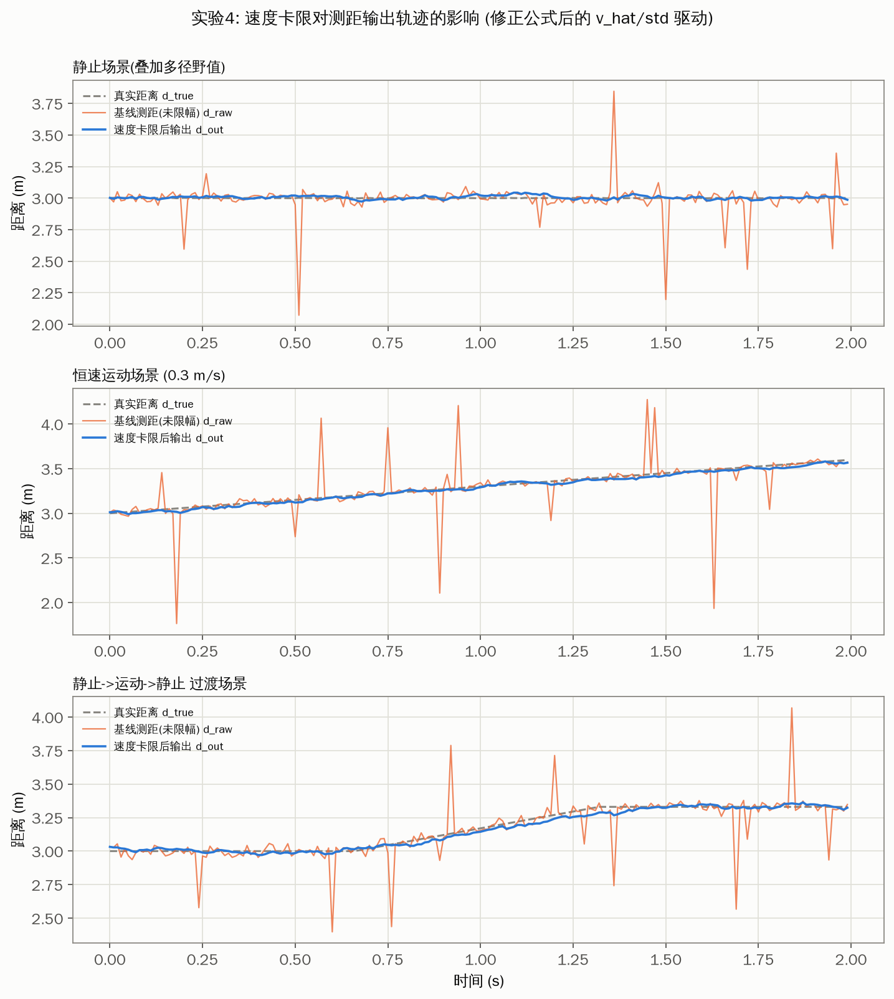
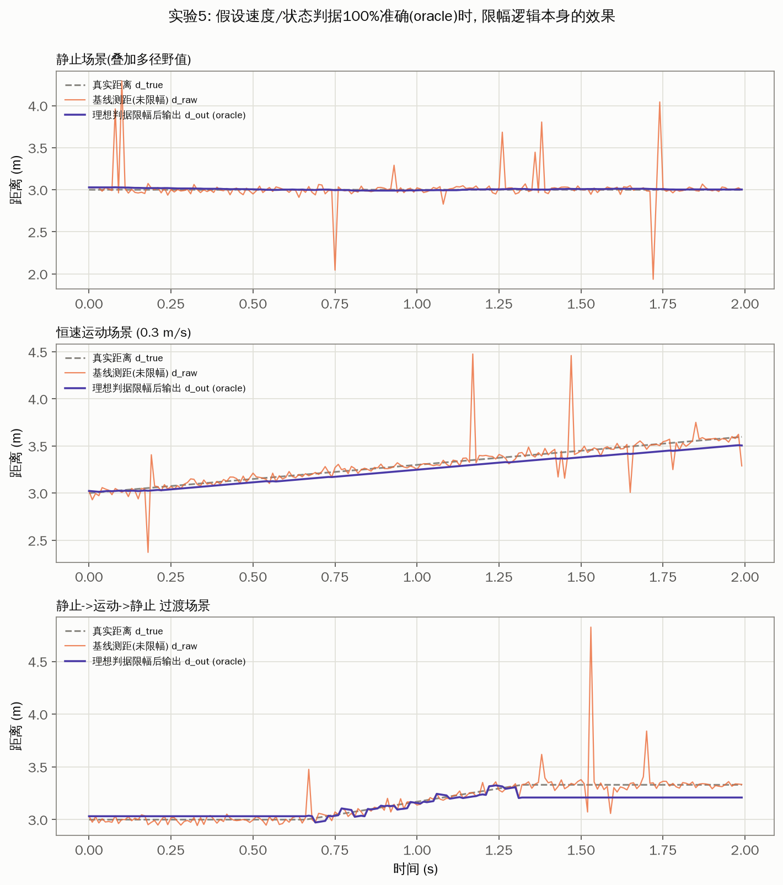
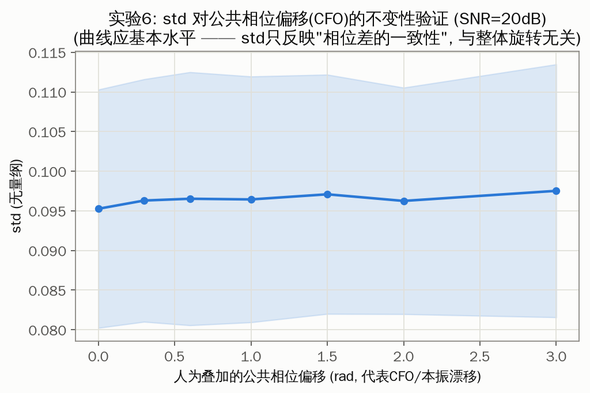

# 星闪测距速度卡限算法设计报告

| | |
|---|---|
| 文档状态 | 草稿 v0.2 (修正相位差/标准差公式后重新仿真; 待实测数据补充与评审) |
| 适用范围 | 星闪(NearLink)/类蓝牙CS 相位测距(PBR)后处理 —— 速度卡限模块 |
| 关联模块 | 依赖上游"基线测距"模块输出的原始测距值 d_raw (本报告不涉及其实现) |

---

## 0. 阅读说明

本报告描述的算法(相位差 DFT 测速 + 两档标准差静止判据 + 限幅)为**现网已实现算法**,
本报告的目标是把其设计原理系统化地写清楚,并用仿真手段对其关键假设做定量核查。

> **v0.2 修订说明**: v0.1 版本对"相位差"公式的理解有误(误把"复数直接相减取相角"当作
> 现网实现)。经与需求方二次确认,现网真实流程是**先分别对两次测量的原始IQ取相位,再对
> 两个相位值做差**,并且标准差判据也不是对相位差直接求实数std,而是**用相位差重建单位
> 复数后,求该复数序列到其均值向量的均方根偏离**。v0.2 已按修正后的公式重新推导、重新
> 编写仿真脚本并重新生成全部结果,结论与 v0.1 有实质性差异(修正后的公式在数学上不再有
> v0.1 中发现的"静止退化为均匀噪声"问题,行为更符合直觉)。v0.1 中基于旧公式的分析已
> 全部替换,不再适用。

仿真发现: 修正后的公式在物理意义上是自洽的(std 随 SNR 单调变化、对本振/CFO相位漂移
天然不变),但在本报告**第 7 节所列的占位系统参数**(尤其测量间隔 Δt、扫频带宽)下,
现实运动速度(0.05~2 m/s)在相邻两轮之间产生的相位变化,相对于两档判据阈值(0.3/0.6)
所需的信号强度而言**明显偏弱**——这不是算法本身的缺陷,而是明确指出**该判据的实际
灵敏度强依赖 Δt、扫频带宽等具体协议参数,必须用实测数据核实**。本报告已将所有这类
参数、结论标注为"待实测数据确认",并给出了具体需要采集什么数据、怎么核对的清单
(见第 8 节)。

全文中出现的 **TODO(实测)** 标记均表示该数值/结论为仿真占位假设,需要用真实协议参数
或实测 IQ 数据替换/验证后才能作为最终设计依据。

---

## 1. 背景与目的

### 1.1 背景

星闪(NearLink)近场测距与蓝牙 Channel Sounding(CS)采用相似的相位测距(Phase-Based
Ranging, PBR)机制: 收发双方在一组频点(信道)上交换单音信号并记录 IQ 复采样,通过
IQ 相位随频点变化的斜率解算收发双方之间的飞行时间/距离。

相位测距对多径、噪声较为敏感,尤其当**设备处于静止状态**时,理想情况下连续多次测距
值应该保持平稳,但受噪声、多径时变、干扰等因素影响,原始测距值(d_raw)仍可能出现
"野值跳变"。为了在静止/低速场景下抑制这类不合理波动,现网引入了一个**基于相邻两次
测量相位差估计运动速度**的后处理模块,用速度信息反推"这段时间内测距值理应变化多少",
以此为测距输出设置动态限幅范围。

### 1.2 目的

本报告的目的是:

1. 系统化描述该速度卡限算法的信号模型、计算步骤与两档判据的设计原理;
2. 用仿真手段验证算法在给定参数下的行为,包括速度估计精度、标准差判据的区分能力、
   限幅前后测距轨迹的对比;
3. 明确指出仿真所依赖的假设参数,标注需要用实测数据替换/校准的位置;
4. 给出下一步实测验证计划。

### 1.3 不在本报告范围内的内容

- 基线测距算法(如何从单次测量的 IQ 得到原始测距值 d_raw)本身的设计与实现,本报告将
  其视为已有的黑盒上游模块;
- 星闪 CS 底层协议帧结构、频点跳变图样、同步与校准流程。

---

## 2. 术语与符号

| 符号 | 含义 |
|---|---|
| round / 测量轮 | 一次完整的多频点相位测距过程,产生一组 IQ(k), k=0..N_F-1 |
| N_F | 每轮测量使用的频点(信道)数 |
| Δf | 相邻频点间隔 (Hz) |
| Δt | 相邻两次测量(round n-1 与 round n)之间的时间间隔 (s) |
| K | 单程/双程系数: 单程测距取 1, 双程(收发双方各计一次相位)取 2 |
| d(n) | 第 n 轮测量时的真实(单程)距离 |
| θ(k,n) | 第 n 轮测量在频点 k 上的相位, θ(k,n) = angle(IQ(k,n)) |
| IQ(k,n) | 第 n 轮测量在频点 k 上的复采样(含噪声/多径) |
| Δφ(k) | 相邻两轮在频点 k 上的相位差, Δφ(k) = wrap( θ(k,n) − θ(k,n−1) ) |
| IQ_diff(k) | 由相位差重建的单位复数, IQ_diff(k) = exp( j·Δφ(k) ) |
| std | IQ_diff(k) 到其均值向量的均方根偏离, 无量纲, 取值范围 [0,1] (见 4.3 节) |
| v_hat | 由 Δφ(k) 关于频点 k 的 DFT 斜率拟合换算得到的速度估计 (m/s) |
| d_raw(n) | 基线测距模块给出的第 n 轮原始测距值 (m) |
| d_out(n) | 速度卡限后的第 n 轮测距输出值 (m) |

---

## 3. 算法总体框图

```
                    ┌─────────────────────┐
  IQ(k, n)          │   基线测距模块 (黑盒,  │        d_raw(n)
  IQ(k, n-1)  ─────▶│  本报告范围外, 现网已有)│───────────────┐
                    └─────────────────────┘                 │
                                                              ▼
  IQ(k, n)          ┌─────────────────────┐   v_hat(n)   ┌────────────────┐
  IQ(k, n-1)  ─────▶│  速度/标准差估计模块    │──────────▶│                 │
                    │  (本报告设计范围)       │  std(n)   │   两档限幅模块    │──▶ d_out(n)
                    │  θ=angle(IQ), Δφ=θ2-θ1│──────────▶│  (本报告设计范围)  │
                    │  DFT斜率拟合 → v_hat   │           │                 │
                    │  IQ_diff=exp(jΔφ)      │           └────────────────┘
                    │  → 复数std             │                  ▲
                    └─────────────────────┘                     │
                                                       d_out(n-1) (状态反馈)
```

速度/标准差估计模块与限幅模块是本报告的设计范围;基线测距模块视为已有的上游黑盒。

---

## 4. 相位差与速度估计原理

### 4.1 单轮测量的理想相位模型

第 n 轮测量、第 k 个频点(频率 f_k = k·Δf)上的理想(无噪)相位为:

```
θ(k, n) = − 2π · K · f_k · d(n) / c        (mod 2π)
```

其中 c 为光速。同一轮内, θ(k,n) 关于频点 k 近似线性(相位斜率), 斜率与距离 d(n)
成正比 —— 这是基线测距模块(不在本报告范围)用来解算绝对距离的基本原理。

### 4.2 相邻两轮的相位差(现网实现, 已二次确认)

现网真实计算步骤为:

```
① θ1(k) = angle( IQ(k, n−1) )              # 分别取相位
② θ2(k) = angle( IQ(k, n) )
③ Δφ(k) = wrap_to_(-π,π]( θ2(k) − θ1(k) )   # 相位直接相减, 而非复数相减
```

若两轮之间目标发生了位移 Δd = d(n) − d(n−1)(由速度 v 与测量间隔 Δt 决定,
Δd ≈ v·Δt),则理想情况下:

```
Δφ(k) = − 2π · K · f_k · Δd / c   (mod 2π, 忽略噪声)
```

即 Δφ(k) 是关于频点 k 的线性函数,斜率正比于 Δd(进而正比于速度 v = Δd/Δt)。设备
静止(Δd≈0)时,Δφ(k) 应在 0 附近小幅波动;设备运动时,Δφ(k) 应呈现随频点 k 变化的
系统性趋势。这是两档静止判据与 DFT 测速的共同设计基础。

**与 v0.1 版本的差异**: v0.1 曾错误地假设现网实现是"复数直接相减后取相角"
(`angle(IQ2−IQ1)`),并在此基础上推导出"静止时信号项恒为0、std退化为均匀分布噪声"
的问题。这一问题**不适用于修正后的"先取相位再相减"公式** —— 后者就是 Δθ 本身
(数学上等价于 `angle(IQ2·conj(IQ1))`),不存在小信号下的幅度损失问题(详见 7.1
节的仿真验证)。

### 4.3 标准差(复数域)的定义(现网实现, 已二次确认)

```
④ IQ_diff(k) = exp( j · Δφ(k) )                          # 用相位差重建单位复数
⑤ std = sqrt( mean_k( |IQ_diff(k) − mean_k(IQ_diff(k))|² ) )   # 到均值向量的RMS偏离
```

由于 |IQ_diff(k)| ≡ 1,该 std 等价于 `sqrt(1 − R²)`,其中 R = |mean_k(IQ_diff(k))|
是复数域均值向量的模长(circular mean resultant length,统计学中常见的"平均向量长
度")。std 的取值范围是 **[0, 1]、无量纲**(并非弧度):

- 各频点 Δφ(k) 高度一致(方向集中,R→1)时,std → 0;
- 各频点 Δφ(k) 分散(方向趋于均匀分布,R→0)时,std → 1。

这一定义在统计学上属于"圆形标准差"(circular statistics)的一种变体,**天然规避了
直接对角度值求普通实数标准差时,在 ±π 处的跳变(wraparound)问题**,也天然对整体旋转
不变 —— 见 7.6 节的仿真验证:给所有频点叠加同一个常数相位偏移(如本振/CFO 漂移)不会
改变 std 的取值,因为它只是让 IQ_diff(k) 整体旋转,不改变各点到均值向量的相对偏离。
这是修正后公式相比"复数直接相减"公式的一个额外优点:**不需要额外担心两轮间残留 CFO
的影响**。

**重要提醒**: v0.1 版本中"0.3/0.6 的单位是弧度(rad)"的表述是**错误的**,已在此版本
修正为无量纲、范围 [0,1]。

### 4.4 DFT 斜率提取(速度估计, 沿用 v0.1 的方法, 输入已改为修正后的 Δφ)

```
s(k)      = IQ_diff(k) = exp( j · Δφ(k) )
S(m)      = FFT( s(k), 补零至 N_FFT 点 )
m*        = argmax_m |S(m)|
slope_hat = 2π · (m*/N_FFT) / Δf     [rad/Hz]
Δd_hat    = − slope_hat · c / (2π·K)
v_hat     = Δd_hat / Δt
```

该方法与仿真脚本 `sim/simulate_speed_gate.py` 中 `dft_slope_to_speed()` 完全一致。
**现网实际实现的峰值搜索/插值方法(是否加窗、是否做二次插值提高分辨率等)需要与研发
确认** —— TODO(实测/现网代码核对)。

---

## 5. 稳定性判据: 复数标准差

### 5.1 两档判据(现网取值)

| 档位 | 判据条件 | 含义 | 限幅半宽度 |
|---|---|---|---|
| 档位1: 低速 | std < 0.6 | 判定为低速运动状态 | range = \|v_hat\| · Δt |
| 档位2: 静止 | std < 0.3 **或** \|v_hat\| < 0.1 m/s | 判定为静止状态 | range = 0.1 · \|v_hat\| · Δt |
| 否则 | — | 正常/快速运动状态 | 不限幅,直接输出 d_raw |

判据为"或"逻辑: 只要标准差很低,或者 DFT 测速本身给出的速度很小,都认为设备静止,
使用更紧的限幅(0.1 倍系数)。档位判断的优先级为: 先判静止(档位2),不满足再判低速
(档位1),否则不限幅。std 定义见 4.3 节,取值范围 [0,1],0.3/0.6 两个阈值即在此范围
内取值,量纲一致,数值上是自洽的。

### 5.2 两档阈值(0.6 / 0.3 / 0.1)的取值依据

现为工程经验值。第 7 节的仿真在给定占位参数下,对这两个阈值做了两方面核查:

1. **std 随 SNR 的变化**(7.1 节): 在假设的信号模型下,std=0.3 对应单频点 SNR
   约 10.2dB,std=0.6 对应约 4.2dB。也就是说,在本报告的占位参数下,这两个阈值的
   数值恰好落在"中低 SNR"区间,数值上是自洽、合理的判决门限范围。
2. **std 随运动量(位移 Δd)的变化**(7.2 节): 要让 std 从 SNR 决定的本底值升高到
   越过 0.6 这个低速门限,大约需要 2.3~2.6 米的单轮位移(占位参数下)。而现实场景
   中最快的"快速运动"(2 m/s)在 Δt=10ms 内只产生 2 厘米的位移,相差 2 个数量级。

第 2 点说明:**在本报告假设的 Δt=10ms、20MHz 扫频带宽下,std 判据对现实运动速度并不
敏感,其数值主要由信噪比/信道质量决定**。这不代表现网算法失效,而是强烈提示: 现网
真实的 Δt、扫频带宽等参数可能与本报告占位值有较大差异,或者 std 判据在真实场景中主要
是通过"运动引起的信道快速时变导致单轮测量等效信噪比下降"这类间接机制起作用(即运动
本身会让同一轮内的相位测量更不稳定,而非仅通过相邻两轮之间的相位斜率变化体现)——这
类机制未被本报告的简化两径信道模型覆盖,需要用实测数据验证,见第 8 节。

---

## 6. 测距值限幅(卡限)算法

### 6.1 限幅逻辑

```
state(n)   = classify( std(n), v_hat(n) )                # 见 5.1 两档判据
range(n)   = |v_hat(n)| · Δt                              若 state = 低速
           = 0.1 · |v_hat(n)| · Δt                        若 state = 静止
           = None (不限幅)                                 若 state = 运动

若 range(n) 为 None:
    d_out(n) = d_raw(n)
否则:
    d_out(n) = clip( d_raw(n),  d_out(n−1) − range(n),  d_out(n−1) + range(n) )
```

即以**上一次限幅后的输出值** d_out(n−1) 为中心,按当前档位给出的动态半宽度做硬限幅
(clamp),而非直接丢弃超范围的测量或做加权融合(已与需求方确认使用限幅方式)。

需要注意: range(n) 由 |v_hat(n)| 而非 std(n) 决定大小,std(n) 只决定"走哪一档"。
第 7.5 节的仿真显示,即使 std 判据本身对速度不敏感(在给定占位参数下几乎恒定判为
"静止"档),只要 v_hat 本身能大致跟踪真实速度(第 7.3 节显示,在中高 SNR 下 DFT
斜率法对 v_hat 的均值估计存在一定的相干处理增益,优于 std 的灵敏度),限幅后的输出
依然能较好跟踪真实运动轨迹、同时压制野值 —— 这是本报告一个值得关注的发现,详见
7.5 节讨论。

### 6.2 边界与冷启动问题(待细化,标注为开放问题)

- **首轮无 d_out(n−1)**: 当前设计取 d_out(0) = d_raw(0)(无历史值可参考,不限幅)。
- **range(n) = 0 的退化情况**: 当 v_hat(n) 恰好为 0 时,尤其静止档(0.1 倍系数)下
  range 可能非常接近 0,导致后续测距值被"焊死"在 d_out(n−1),对真实的缓慢漂移不敏感。
  是否需要设置 range_min 下限保护,现网实现待确认 —— TODO(实测/现网代码核对)。
- **状态切换的瞬态响应**: 从静止转为运动时,由于限幅以上一次输出为中心,前几轮的
  d_out 会明显滞后于真实距离变化(见第 7.5 节实验5的过渡场景曲线),该滞后量级
  需要结合实际业务对响应时延的要求评估是否可接受。

---

## 7. 仿真验证

仿真脚本: `sim/simulate_speed_gate.py`(Python,依赖 numpy/matplotlib),完整实现了
第 4~6 节描述的信号模型与算法链路(含修正后的相位差/复数标准差公式)。运行方式见
附录 A。所有图表已生成于 `sim/results/`。

> **仿真参数假设一览(均为占位值,需与现网协议/实测数据核对)**
>
> | 参数 | 占位值 | 说明 |
> |---|---|---|
> | N_F(频点数) | 21 | TODO(实测) |
> | Δf(频点间隔) | 1 MHz | TODO(实测),决定了 20MHz 的扫频总带宽 |
> | Δt(测量间隔) | 10 ms | TODO(实测),对 7.2 节的结论影响很大 |
> | K(单程/双程系数) | 2(双程) | TODO(实测) |
> | 单频点 SNR | 10~40 dB(部分实验扫描到 -5~40dB) | TODO(实测) |
> | 典型工作距离 | 0.3~3 m | TODO(实测) |
> | 典型运动速度范围 | 静止 0; 低速 0.05~0.3 m/s; 快速 0.5~2 m/s | TODO(实测业务场景) |

### 7.1 实验0: 修正公式后,静止目标的 std 随 SNR 的变化



**方法**: 目标严格静止(v_true=0),扫描单频点 SNR 从 −5 到 40dB,统计 std 的均值与
10~90 百分位。

**结果**: std 随 SNR 提升单调下降,从低 SNR 时接近 1(均匀分布上限)平滑下降到高 SNR
时接近 0。std=0.3(静止门限)对应 SNR≈10.2dB;std=0.6(低速门限)对应 SNR≈4.2dB。

**结论**: 修正后的"先取相位再相减 + 复数标准差"公式在数学上是良态的 —— 不再出现
v0.1 版本中"静止时 std 恒为均匀分布上限、与 SNR 无关"的退化现象。这验证了公式修正的
必要性和正确性。同时也说明,在缺乏运动的情况下,std 本身就是一个合理的**信道质量
(SNR)指示器**,这一点在解读第 7.4 节"三态分布高度重叠"的结果时很关键。

### 7.2 实验0b: std 对运动量(单轮位移 Δd)的响应曲线



**方法**: 固定 SNR(10/20/30dB 三档),扫描相邻两轮之间的位移 Δd(对数坐标,从
0.1mm 到约 32m),观察 std 何时开始明显抬升、何时越过两档阈值。图中标注了当前占位
Δt=10ms 下,"2 m/s 快速运动"对应的单轮位移(20mm)。

**结果**: 三条曲线在 Δd 小于约 0.1~0.3m 时都保持在各自 SNR 对应的本底值附近基本
不变,直到 Δd 超过约 1m 才开始明显抬升,越过低速门限(0.6)大致需要 2.3~2.6m 的
单轮位移(与 SNR 关系不大)。而现实"快速运动"场景下的单轮位移仅 20mm,位于曲线的
平坦区(远未开始抬升)。

**结论**: 这是本报告最关键的定量发现——**在占位的 Δt=10ms / 20MHz 扫频带宽下,
std 判据对现实运动速度范围(0.05~2 m/s)基本不敏感,需要约 100 倍以上的位移量才能
触发状态跳变**。若现网 Δt 或扫频带宽的真实取值明显大于本报告占位值(例如 Δt 是
100ms~1s 量级,或扫频带宽是数百 MHz 量级),则该曲线会相应左移,实际灵敏度会好得多
——这正是需要用真实协议参数复核该图的原因(TODO 实测)。

### 7.3 实验1: 速度估计 v_hat 与标准差随真实速度的变化



**方法**: (a)(b) 真实速度 v_true 在现实范围 [−2, 2] m/s 内扫描,SNR 分别取
10/20/30dB;(c) 在信噪比更高(40dB)、且把速度范围扩展到非现实高速(对数坐标至
约 300 m/s)的条件下,观察 v_hat 何时开始无偏跟踪真实速度。

**结果**: (a) v_hat 的均值在 SNR=20/30dB 时大致跟随真实速度的对角线趋势,但单次
估计噪声很大(SNR=10dB 时几乎看不出趋势);(b) std 在整个现实速度范围内基本走平,
与实验0b 一致;(c) 在 SNR=40dB 下,v_hat 大约要到真实速度超过 1~2 m/s 量级才开始
稳定无偏跟踪,更低速度区间仍受 DFT 频率分辨率与噪声主导。

**结论**: 修正公式后,DFT 斜率法对 v_hat 的**均值**估计存在一定的相干处理增益(21
个频点联合处理带来约 13dB 等效增益),使其在现实速度范围内的灵敏度**好于** std 判据
(std 完全不随速度变化,v_hat 均值至少有趋势可辨)。这提示: 若要在当前假设参数下增强
判据灵敏度,可考虑更多倚重 v_hat 本身(现网逻辑中已经通过 \|v_hat\|<0.1 参与静止判定,
以及 range 直接用 v_hat 加权,见 6.1 节),而不完全依赖 std。

### 7.4 实验2: 三种运动状态下 std 分布



**方法**: 在 SNR=20dB、工作距离 0.3~3m 条件下,对静止/低速/快速运动三种状态各做
1000 次蒙特卡洛试验,绘制 std 分布箱线图。

**结果**: 三种状态的 std 分布几乎完全重叠(中位数均在 0.096 附近,均远低于两档
阈值),与实验0b 的结论一致——在 SNR=20dB、占位 Δt/带宽下,std 几乎完全由信道
噪声本底决定,运动状态的影响可忽略。

### 7.5 实验3: 两档判据分类性能(混淆矩阵 + 阈值扫描)



**方法**: (a) 用现网阈值(0.6/0.3/0.1)对三种真实状态做分类,统计混淆矩阵;
(b) 扫描静止档 std 阈值,统计"真实静止→判定为静止"的检出率与"真实快速运动→
判定为静止"的虚警率。

**结果**: (a) 在 SNR=20dB 占位条件下,三种真实状态 **100% 被判定为"静止"档**
(与 v0.1 版本旧公式下"100%判为运动"的结果正好相反)。(b) 阈值扫描显示,std 分布
本身集中在 0.05~0.15 区间,静止门限 0.3 位于分布的极右尾之外,因此无论真实状态
如何,几乎总是落入静止档。

**结论**: 在当前占位 SNR=20dB 下,std 判据本身不参与实际决策(因为它总是满足静止
条件)——真正在起作用的是 6.1 节提到的 `|v_hat|<0.1` 这个速度条件与 range 本身
随 v_hat 的缩放。这与 7.3 节的发现相互印证:在给定参数下,v_hat 而非 std 承担了
主要的"感知运动"职责。这一结论**高度依赖占位的 SNR=20dB 假设**,若实测 SNR 明显
更低(例如 5~10dB,参照实验0 中两档阈值对应的隐含 SNR),std 判据本身可能会更活跃
地参与决策,需要用实测数据重新核实(TODO 实测)。

### 7.6 实验4: 用当前(修正公式)估计的 v_hat/std 做限幅的效果



**方法**: 构造三种基线测距轨迹场景(静止叠加多径野值 / 恒速 0.3m/s 运动 / 静止→
运动→静止过渡),用本报告实现的 DFT 测速 + 复数标准差判据驱动限幅逻辑,对比限幅前后
(d_raw vs d_out)与真实距离(d_true)的轨迹。

**结果**(RMSE 单位: m):

| 场景 | RMSE(d_raw, d_true) | RMSE(d_out, d_true) | 最大单步跳变(限幅前) | 最大单步跳变(限幅后) |
|---|---|---|---|---|
| 静止 + 多径野值 | 0.131 | **0.014** | 1.00 m | **0.026 m** |
| 恒速运动 0.3m/s | 0.222 | **0.021** | 1.58 m | **0.022 m** |
| 静止→运动→静止过渡 | 0.132 | **0.022** | 0.78 m | **0.022 m** |

**结论**: 尽管 7.5 节显示 std 判据在当前参数下总是判"静止"(触发最紧的 0.1 倍限幅),
限幅后的输出依然较好地跟踪了真实的匀速运动轨迹(0.3m/s 场景 RMSE 从 0.222m 降到
0.021m),同时有效压制了多径野值。**原因是 range 的大小由 v_hat 决定,而 v_hat
本身对真实速度有一定的均值跟踪能力**(见 7.3 节)——即使状态判据"永远判静止"、
用的是最紧的 0.1 倍系数,只要 v_hat 的量级基本正确,限幅范围仍能随真实运动自适应
放大,不会把运动目标"焊死"。这是一个好消息,但也说明当前效果**部分是巧合性地依赖
v_hat 的相干增益**,并非 std 判据本身在正确工作,建议结合实测数据重新评估这一现象
是否在真实系统中同样成立。

### 7.7 实验5: 理想(oracle)判据下限幅逻辑本身的效果



为了把"限幅逻辑本身是否有效"与"当前公式能否提供准确的 v_hat/std"这两个问题
解耦,本实验**直接使用真实速度 v_true**(而非由 IQ 估计出的 v_hat/std)驱动同一套
两档限幅逻辑,代表"上游速度/状态判据 100% 准确"的理想情况。

**结果**(RMSE 单位: m):

| 场景 | RMSE(d_raw, d_true) | RMSE(d_out, d_true) | 最大单步跳变(限幅前) | 最大单步跳变(限幅后) |
|---|---|---|---|---|
| 静止 + 多径野值 | 0.191 | **0.011** | 1.33 m | **0.004 m** |
| 恒速运动 0.3m/s | 0.135 | **0.056** | 1.15 m | **0.003 m** |
| 静止→运动→静止过渡 | 0.125 | **0.075** | 1.75 m | 0.103 m |

**结论**: 当速度/状态判据完全准确时,两档限幅逻辑能非常有效地抑制多径野值(静止
场景 RMSE 降低约 17 倍,最大单步跳变从 1.33m 压到 4mm),同时仍能较好跟踪真实的
匀速运动,过渡场景也能以有限的响应滞后跟上状态切换。**这证明限幅逻辑本身的设计是
合理、有效的**;结合 7.6 节的发现,当前瓶颈主要在于如何让 std 判据本身(而不仅是
v_hat)在实际协议参数下对运动更敏感,这需要依靠实测数据来解决(见第 8 节)。

### 7.8 实验6: std 对公共相位偏移(CFO)的不变性验证



**方法**: 在两轮 IQ 之间人为叠加一个从 0 到 3rad 的公共相位偏移(代表本振/CFO
漂移,对所有频点相同),观察 std 的变化。

**结果**: std 全程稳定在 0.095~0.098 区间,相对变化幅度仅 2.3%,基本不受叠加的
公共相位偏移影响。

**结论**: 验证了 4.3 节的解析结论——修正后的复数标准差定义对整体相位旋转(如两轮
间的 CFO/本振漂移)天然不变。这是相比"复数直接相减"公式的一个额外优点,现网无需
为 CFO 残留误差做额外补偿即可保证 std 判据的物理意义稳定。

---

## 8. 实测验证计划(待实测数据补充)

本节所有具体数值、图表均为**占位**,需要在拿到实测 IQ 数据后补充完整 —— 整节标注
TODO(实测)。

### 8.1 测试场景设计

| 场景 | 说明 | 数量建议 |
|---|---|---|
| 严格静止 | 设备固定于支架,记录 IQ 与对应的 d_raw 序列 | ≥10 组,不同绝对距离/环境 |
| 静止(带微动) | 设备置于人手持/桌面等有微小振动的场景 | ≥10 组 |
| 低速运动 | 0.05~0.3 m/s,匀速走动或滑轨匀速拖动 | ≥10 组,含不同方向(靠近/远离) |
| 快速运动 | 0.5~2 m/s | ≥10 组 |
| 静止↔运动切换 | 用于评估状态切换瞬态响应 | ≥5 组 |
| 不同信道环境 | 近距离 LOS、远距离 LOS、室内 NLOS/多径丰富环境 | 每种环境覆盖上述场景 |

### 8.2 需要采集的数据(TODO 实测)

- 每轮测量的原始 IQ(k,n) 复采样(全部 N_F 个频点),而不仅仅是最终测距值,用于
  离线复现 Δφ(k)、std、v_hat 的真实分布;
- 高精度 ground-truth 位置/速度参考(如光学动捕、编码器滑轨、RTK),用于标定
  v_true 与 std/v_hat 的真实映射关系;
- 现网实际使用的 N_F、Δf、Δt、K 等协议参数的确认值(替换第 7 节表格中的占位值,
  **Δt 与扫频带宽尤其关键**,见 7.2 节);
- 现网实测的单频点 SNR / 信噪比范围,及典型多径环境下的信道相干时间估计;
- 若条件允许,采集"运动中单轮内部"的相位稳定性数据(而不仅是轮间差异),用于验证
  7.5 节提出的"运动导致同轮测量等效SNR下降"假设是否成立。

### 8.3 待验证/标定的结论清单

1. 第 7.2 节发现的"现实速度在占位 Δt/带宽下位移量过小、std 不敏感"的结论,在
   真实协议参数下是否依然成立;若 Δt/扫频带宽显著大于占位值,该问题可能自动缓解。
2. 第 7.5 节"v_hat 承担主要感知职责"的现象,在真实系统的 SNR 工作点下是否同样成立,
   还是 std 判据本身会更活跃地参与决策。
3. 两档阈值(0.6 / 0.3 / 0.1)在真实 std 分布下的检出率/虚警率(参照实验3的分析
   方法,用实测数据重新绘制阈值扫描曲线)。
4. DFT 斜率法 v_hat 相对真实速度的估计偏差与噪声水平(参照实验1的分析方法)。
5. 限幅逻辑(第 6 节)在真实基线测距野值分布下的实际抑制效果(参照实验4/5的分析
   方法,用真实 d_raw 数据替换仿真中的野值模型)。
6. range_min 下限保护、冷启动、状态切换瞬态响应等第 6.2 节列出的边界问题的现网
   实际处理方式。

---

## 9. 风险与待确认事项汇总

| # | 事项 | 类型 | 影响 |
|---|---|---|---|
| 1 | N_F、Δf、Δt、K 的真实协议取值 | 参数确认 | 直接决定 std 判据的实际灵敏度,见 7.2 节 |
| 2 | std 判据在占位参数下对现实速度不敏感, 主要由 SNR 决定 | 待验证假设 | 可能意味着 std 更多反映信道质量而非运动本身 |
| 3 | v_hat 在中高 SNR 下承担了主要的"感知运动"职责(7.3/7.6节) | 待验证假设 | 若真实 SNR 更低, 结论可能反转, 需要重新评估 |
| 4 | 0.6/0.3/0.1 三个阈值的标定依据 | 参数标定 | 需要实测 std/v_hat 分布重新扫描 |
| 5 | DFT 峰值搜索的具体实现(加窗/插值等) | 实现细节确认 | 影响 v_hat 精度,需与现网代码核对 |
| 6 | range_min 下限保护是否存在 | 实现细节确认 | 影响静止档是否会"焊死"测距输出 |
| 7 | 冷启动(首轮无 d_out(n-1))处理方式 | 实现细节确认 | 影响上电初期输出行为 |
| 8 | 状态切换瞬态响应时延是否满足业务要求 | 待验证假设 | 见实验5过渡场景,需实测数据复核 |

---

## 附录 A: 仿真脚本运行说明

```bash
cd sim
python3 simulate_speed_gate.py
```

依赖: `numpy`, `matplotlib`(`pip install numpy matplotlib`)。

输出:
- `sim/results/exp0_std_vs_snr.png` ~ `exp6_cfo_invariance.png`: 对应第 7 节各实验图;
- `sim/results/summary.json`: 全部实验的关键数值结果(均值、RMSE 等),供报告引用与后续复核对比。

脚本内所有可调参数集中在文件顶部"1. 仿真参数"一节,并逐一标注 `TODO(实测)`,
替换为现网真实参数后可直接重新运行,复现本报告全部图表。

## 附录 B: 核心公式速查

```
θ1(k), θ2(k) = angle(IQ(k,n−1)), angle(IQ(k,n))
Δφ(k)        = wrap_to_(-π,π]( θ2(k) − θ1(k) )
IQ_diff(k)   = exp( j·Δφ(k) )
std          = sqrt( mean_k( |IQ_diff(k) − mean_k(IQ_diff(k))|² ) )     # 无量纲 [0,1]
v_hat        = DFT_slope( {Δφ(k)} ) 换算得到 (见 4.4 节)

state = 静止   若 std < 0.3  或  |v_hat| < 0.1
state = 低速   若 std < 0.6 (且不满足静止条件)
state = 运动   否则

range = |v_hat|·Δt        (低速档)
      = 0.1·|v_hat|·Δt    (静止档)

d_out(n) = clip( d_raw(n), d_out(n−1) − range, d_out(n−1) + range )   (低速/静止档)
d_out(n) = d_raw(n)                                                    (运动档)
```
