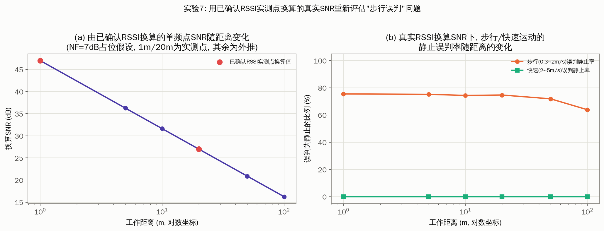

# 星闪测距速度卡限算法设计报告

| | |
|---|---|
| 文档状态 | 草稿 v0.5 (已代入 K/频点/Δt/扫频频段/工作距离/速度分级/DFT搜索范围/真实RSSI换算SNR; 待接收机噪声系数NF与基线测距野值特性补充评审) |
| 适用范围 | 星闪(NearLink)/类蓝牙CS 相位测距(PBR)后处理 —— 速度卡限模块 |
| 关联模块 | 依赖上游"基线测距"模块输出的原始测距值 d_raw (本报告不涉及其实现) |

---

## 0. 阅读说明

本报告描述的算法(相位差 DFT 测速 + 两档标准差静止判据 + 限幅)为**现网已实现算法**,
本报告的目标是把其设计原理系统化地写清楚,并用仿真手段对其关键假设做定量核查。

> **版本修订说明**
> - **v0.2**: 修正了相位差/标准差公式(v0.1 误把"复数直接相减取相角"当作现网实现)。
>   经与需求方二次确认,现网真实流程是**先分别对两次测量的原始IQ取相位,再对两个相位
>   值做差**,标准差判据是**用相位差重建单位复数后,求该复数序列到其均值向量的均方根
>   偏离**(无量纲,范围[0,1],而非弧度)。
> - **v0.3**: 代入需求方确认的 **Δt=200ms(5Hz)、扫频频段2400~2479MHz(79MHz带宽)**。
> - **v0.4**: 进一步代入需求方确认的 **K=2(双程,与仿真假设一致)、频点间隔确为
>   1MHz/80个频点全用(与仿真假设一致)、典型工作距离0~100米以上、以及速度分级定义
>   (慢速<0.3m/s、步行<2m/s、快速<5m/s)与DFT测速的确认搜索范围(±5m/s、0.05m/s
>   分辨率)**。仿真据此重新配置(DFT峰值搜索限定在±5m/s窗口内并按0.05m/s量化,
>   速度分组改为静止/慢速/步行/快速四级)并重新生成全部结果,**结论发生了重要的
>   修正**——"约2/3快速运动被误判静止"实为基于错误速度范围猜测的产物;代入正确
>   定义后,"快速"(2~5m/s)100%被正确识别,但"步行"(0.3~2m/s)仍有约2/3概率被
>   误判为静止。
> - **v0.5(本版本)**: 代入需求方确认的**真实RSSI实测点(1m处约-60dBm,20m处约
>   -80dBm)**,结合接收机噪声系数(NF,仍为占位假设)换算出**真实单频点SNR
>   (约16~47dB,随距离变化)**,替换此前 10/20/30dB 的任意占位假设,用真实SNR
>   重新验证"步行误判"问题(见 7.9 节新增实验7)。目前唯一仍未确认的关键参数是
>   **接收机噪声系数(NF)**——一个相对次要、有典型范围可依据的参数,继续标注
>   TODO(实测/查规格书)。

v0.5 最重要的发现是:**用需求方提供的真实RSSI实测点换算出的SNR(约16~47dB,覆盖
1~100m全部确认工作距离),"步行误判静止"问题不仅没有消失,反而比此前用20dB占位假设
估计的66%误判率略高(64%~76%,随距离变化)**,而"快速"(2~5m/s)在全部距离下依然
保持 0% 误判。这说明:

1. **"步行误判"不是某个任意SNR假设下的巧合,而是在需求方提供的真实信号强度水平下
   稳健存在的问题**(见 7.9 节),置信度比 v0.4 版本更高。
2. **"快速"(2~5 m/s)运动在全部已确认工作距离下都被 std 判据 100% 正确识别为
   "非静止"**,对应场景下限幅输出也能很好地跟踪真实轨迹(见 7.6 节)。
3. 速度估计 v_hat 在已确认的 ±5m/s 搜索范围内表现良好(均值紧密跟踪真实速度,见
   7.3 节),DFT 峰值搜索限定在确认的搜索窗口内也验证了在超出 5m/s 后 v_hat 会
   被限定在边界、不再跟踪(符合预期的设计行为)。
4. 限幅逻辑本身固有的"一次较大野值造成的偏移在观测窗口内不易完全恢复"的性质依然
   成立(见 7.7 节),与判据准确性无关。

全文中出现的 **TODO(实测)** 标记均表示该数值/结论为仿真占位假设,需要用真实协议
参数或实测 IQ 数据替换/验证后才能作为最终设计依据 —— 目前主要剩下接收机噪声系数
(NF)与基线测距(d_raw)真实野值特性两项,详见第 8、9 节。

---

## 1. 背景与目的

### 1.1 背景

星闪(NearLink)近场测距与蓝牙 Channel Sounding(CS)采用相似的相位测距(Phase-Based
Ranging, PBR)机制: 收发双方在一组频点(信道)上交换单音信号并记录 IQ 复采样,通过
IQ 相位随频点变化的斜率解算收发双方之间的飞行时间/距离。

相位测距对多径、噪声较为敏感,尤其当**设备处于静止状态**时,理想情况下连续多次测距
值应该保持平稳,但受噪声、多径时变、干扰等因素影响,原始测距值(d_raw)仍可能出现
"野值跳变"。为了在静止/低速场景下抑制这类不合理波动,现网引入了一个**基于相邻两次
测量相位差估计运动速度**的后处理模块,用速度信息反推"这段时间内测距值理应变化多少",
以此为测距输出设置动态限幅范围。

### 1.2 目的

本报告的目的是:

1. 系统化描述该速度卡限算法的信号模型、计算步骤与两档判据的设计原理;
2. 用仿真手段验证算法在给定参数下的行为,包括速度估计精度、标准差判据的区分能力、
   限幅前后测距轨迹的对比;
3. 明确指出仿真所依赖的假设参数,标注需要用实测数据替换/校准的位置;
4. 给出下一步实测验证计划。

### 1.3 不在本报告范围内的内容

- 基线测距算法(如何从单次测量的 IQ 得到原始测距值 d_raw)本身的设计与实现,本报告将
  其视为已有的黑盒上游模块;
- 星闪 CS 底层协议帧结构、频点跳变图样、同步与校准流程。

---

## 2. 术语与符号

| 符号 | 含义 |
|---|---|
| round / 测量轮 | 一次完整的多频点相位测距过程,产生一组 IQ(k), k=0..N_F-1 |
| N_F | 每轮测量使用的频点(信道)数 |
| Δf | 相邻频点间隔 (Hz) |
| Δt | 相邻两次测量(round n-1 与 round n)之间的时间间隔 (s) |
| K | 单程/双程系数: 单程测距取 1, 双程(收发双方各计一次相位)取 2 |
| d(n) | 第 n 轮测量时的真实(单程)距离 |
| θ(k,n) | 第 n 轮测量在频点 k 上的相位, θ(k,n) = angle(IQ(k,n)) |
| IQ(k,n) | 第 n 轮测量在频点 k 上的复采样(含噪声/多径) |
| Δφ(k) | 相邻两轮在频点 k 上的相位差, Δφ(k) = wrap( θ(k,n) − θ(k,n−1) ) |
| IQ_diff(k) | 由相位差重建的单位复数, IQ_diff(k) = exp( j·Δφ(k) ) |
| std | IQ_diff(k) 到其均值向量的均方根偏离, 无量纲, 取值范围 [0,1] (见 4.3 节) |
| v_hat | 由 Δφ(k) 关于频点 k 的 DFT 斜率拟合换算得到的速度估计 (m/s) |
| d_raw(n) | 基线测距模块给出的第 n 轮原始测距值 (m) |
| d_out(n) | 速度卡限后的第 n 轮测距输出值 (m) |

---

## 3. 算法总体框图

```
                    ┌─────────────────────┐
  IQ(k, n)          │   基线测距模块 (黑盒,  │        d_raw(n)
  IQ(k, n-1)  ─────▶│  本报告范围外, 现网已有)│───────────────┐
                    └─────────────────────┘                 │
                                                              ▼
  IQ(k, n)          ┌─────────────────────┐   v_hat(n)   ┌────────────────┐
  IQ(k, n-1)  ─────▶│  速度/标准差估计模块    │──────────▶│                 │
                    │  (本报告设计范围)       │  std(n)   │   两档限幅模块    │──▶ d_out(n)
                    │  θ=angle(IQ), Δφ=θ2-θ1│──────────▶│  (本报告设计范围)  │
                    │  DFT斜率拟合 → v_hat   │           │                 │
                    │  IQ_diff=exp(jΔφ)      │           └────────────────┘
                    │  → 复数std             │                  ▲
                    └─────────────────────┘                     │
                                                       d_out(n-1) (状态反馈)
```

速度/标准差估计模块与限幅模块是本报告的设计范围;基线测距模块视为已有的上游黑盒。

---

## 4. 相位差与速度估计原理

### 4.1 单轮测量的理想相位模型

第 n 轮测量、第 k 个频点(频率 f_k = k·Δf)上的理想(无噪)相位为:

```
θ(k, n) = − 2π · K · f_k · d(n) / c        (mod 2π)
```

其中 c 为光速。同一轮内, θ(k,n) 关于频点 k 近似线性(相位斜率), 斜率与距离 d(n)
成正比 —— 这是基线测距模块(不在本报告范围)用来解算绝对距离的基本原理。

### 4.2 相邻两轮的相位差(现网实现, 已二次确认)

现网真实计算步骤为:

```
① θ1(k) = angle( IQ(k, n−1) )              # 分别取相位
② θ2(k) = angle( IQ(k, n) )
③ Δφ(k) = wrap_to_(-π,π]( θ2(k) − θ1(k) )   # 相位直接相减, 而非复数相减
```

若两轮之间目标发生了位移 Δd = d(n) − d(n−1)(由速度 v 与测量间隔 Δt 决定,
Δd ≈ v·Δt),则理想情况下:

```
Δφ(k) = − 2π · K · f_k · Δd / c   (mod 2π, 忽略噪声)
```

即 Δφ(k) 是关于频点 k 的线性函数,斜率正比于 Δd(进而正比于速度 v = Δd/Δt)。设备
静止(Δd≈0)时,Δφ(k) 应在 0 附近小幅波动;设备运动时,Δφ(k) 应呈现随频点 k 变化的
系统性趋势。这是两档静止判据与 DFT 测速的共同设计基础。

**与 v0.1 版本的差异**: v0.1 曾错误地假设现网实现是"复数直接相减后取相角"
(`angle(IQ2−IQ1)`),并在此基础上推导出"静止时信号项恒为0、std退化为均匀分布噪声"
的问题。这一问题**不适用于修正后的"先取相位再相减"公式** —— 后者就是 Δθ 本身
(数学上等价于 `angle(IQ2·conj(IQ1))`),不存在小信号下的幅度损失问题(详见 7.1
节的仿真验证)。

### 4.3 标准差(复数域)的定义(现网实现, 已二次确认)

```
④ IQ_diff(k) = exp( j · Δφ(k) )                          # 用相位差重建单位复数
⑤ std = sqrt( mean_k( |IQ_diff(k) − mean_k(IQ_diff(k))|² ) )   # 到均值向量的RMS偏离
```

由于 |IQ_diff(k)| ≡ 1,该 std 等价于 `sqrt(1 − R²)`,其中 R = |mean_k(IQ_diff(k))|
是复数域均值向量的模长(circular mean resultant length,统计学中常见的"平均向量长
度")。std 的取值范围是 **[0, 1]、无量纲**(并非弧度):

- 各频点 Δφ(k) 高度一致(方向集中,R→1)时,std → 0;
- 各频点 Δφ(k) 分散(方向趋于均匀分布,R→0)时,std → 1。

这一定义在统计学上属于"圆形标准差"(circular statistics)的一种变体,**天然规避了
直接对角度值求普通实数标准差时,在 ±π 处的跳变(wraparound)问题**,也天然对整体旋转
不变 —— 见 7.6 节的仿真验证:给所有频点叠加同一个常数相位偏移(如本振/CFO 漂移)不会
改变 std 的取值,因为它只是让 IQ_diff(k) 整体旋转,不改变各点到均值向量的相对偏离。
这是修正后公式相比"复数直接相减"公式的一个额外优点:**不需要额外担心两轮间残留 CFO
的影响**。

**重要提醒**: v0.1 版本中"0.3/0.6 的单位是弧度(rad)"的表述是**错误的**,已在此版本
修正为无量纲、范围 [0,1]。

### 4.4 DFT 斜率提取(速度估计, 沿用 v0.1 的方法, 输入已改为修正后的 Δφ)

```
s(k)      = IQ_diff(k) = exp( j · Δφ(k) )
S(m)      = FFT( s(k), 补零至 N_FFT 点 )
m*        = argmax_{m: |v(m)|≤5m/s} |S(m)|     # 已确认: 只在±5m/s对应的频点范围内搜索峰值
slope_hat = 2π · (m*/N_FFT) / Δf     [rad/Hz]
Δd_hat    = − slope_hat · c / (2π·K)
v_hat     = round( (Δd_hat/Δt) / 0.05 ) · 0.05  # 已确认: 按0.05m/s分辨率量化输出
```

**搜索范围与分辨率已确认**: DFT 测速的搜索范围为 −5~5 m/s,速度分辨率为 0.05 m/s
——即峰值搜索被限定在对应 ±5m/s 的频点窗口内(而非在整个不模糊的 DFT 范围内取全局
峰值),输出按 0.05 m/s 量化。仿真已按此更新(见 `dft_slope_to_speed()`),7.3 节
实验1的(c)图验证了这一限定行为:真实速度超出 ±5m/s 后 v_hat 不再跟踪,被限定在
搜索窗边界附近。**现网峰值搜索是否额外做了加窗/插值提高分辨率**仍需与研发确认 ——
TODO(实测/现网代码核对)。

---

## 5. 稳定性判据: 复数标准差

### 5.1 两档判据(现网取值)

| 档位 | 判据条件 | 含义 | 限幅半宽度 |
|---|---|---|---|
| 档位1: 低速 | std < 0.6 | 判定为低速运动状态 | range = \|v_hat\| · Δt |
| 档位2: 静止 | std < 0.3 **或** \|v_hat\| < 0.1 m/s | 判定为静止状态 | range = 0.1 · \|v_hat\| · Δt |
| 否则 | — | 正常/快速运动状态 | 不限幅,直接输出 d_raw |

判据为"或"逻辑: 只要标准差很低,或者 DFT 测速本身给出的速度很小,都认为设备静止,
使用更紧的限幅(0.1 倍系数)。档位判断的优先级为: 先判静止(档位2),不满足再判低速
(档位1),否则不限幅。std 定义见 4.3 节,取值范围 [0,1],0.3/0.6 两个阈值即在此范围
内取值,量纲一致,数值上是自洽的。

### 5.2 两档阈值(0.6 / 0.3 / 0.1)的取值依据

现为工程经验值。第 7 节的仿真代入已确认参数后,对这两个阈值做了两方面核查:

1. **std 随 SNR 的变化**(7.1 节): std=0.3 对应单频点 SNR 约 10.5dB,std=0.6 对应
   约 4.4dB。而由已确认 RSSI 实测点换算出的真实单频点 SNR 约为 16~47dB(见 7.9
   节),**明显高于这两个阈值对应的 SNR 水平**——也就是说,在真实信号强度下,静止
   状态的 std 本底值应该远低于 0.3(不会因为噪声偏高而误触发低速/静止判据),这一点
   在 7.9 节的仿真中也得到了印证。
2. **std 随运动量(位移 Δd)的变化**(7.2 节): 要让 std 从 SNR 决定的本底值升高到
   越过 0.6 这个低速门限,大约需要 0.6~0.68 米的单轮位移。代入已确认的 Δt=200ms、
   79MHz 扫频带宽、以及确认的速度分级后:"快速"(2~5 m/s)运动的单轮位移达到
   0.4~1.0 米,**已经跨过甚至超出这个门槛**;而"步行"(0.3~2 m/s)运动的单轮位移
   仅 60mm~400mm,大部分仍处于曲线的平坦区。

第 2 点结论经 7.4/7.5 节的四级速度分组仿真验证: **"快速"(2~5 m/s)现在 100% 被
正确识别为非静止(0% 误判静止);但"步行"(0.3~2 m/s,大概率是最常见的真实使用
场景)仍有约 66% 的样本被判为静止**,触发最强的 0.1 倍收紧系数。这精确定位了
std 判据当前的短板区间——不是所有运动都测不准,而是**恰好覆盖最常见的日常步行速度
的这个区间**测不准,这正是 7.6 节发现的限幅严重滞后问题的根源。是否需要调整阈值、
或改进判据本身(例如引入"运动引起同轮测量等效信噪比下降"这类间接机制,本报告的
简化两径信道模型未覆盖此机制),需要用实测数据核实真实 std 分布后决定,详见第
8、9 节。

---

## 6. 测距值限幅(卡限)算法

### 6.1 限幅逻辑

```
state(n)   = classify( std(n), v_hat(n) )                # 见 5.1 两档判据
range(n)   = |v_hat(n)| · Δt                              若 state = 低速
           = 0.1 · |v_hat(n)| · Δt                        若 state = 静止
           = None (不限幅)                                 若 state = 运动

若 range(n) 为 None:
    d_out(n) = d_raw(n)
否则:
    d_out(n) = clip( d_raw(n),  d_out(n−1) − range(n),  d_out(n−1) + range(n) )
```

即以**上一次限幅后的输出值** d_out(n−1) 为中心,按当前档位给出的动态半宽度做硬限幅
(clamp),而非直接丢弃超范围的测量或做加权融合(已与需求方确认使用限幅方式)。

需要注意: range(n) 由 |v_hat(n)| 而非 std(n) 决定大小,std(n) 只决定"走哪一档"
(从而决定 0.1 倍收紧系数是否生效)。第 7.3 节显示 v_hat 本身(已确认参数下)在
确认的 ±5m/s 搜索范围内已经能较准确地跟踪真实速度;第 7.5 节的仿真显示,std 判据
对"快速"(2~5 m/s)运动已能 100% 正确识别为非静止,对应场景下限幅输出跟踪良好。
但**对"步行"(0.3~2 m/s,大概率是最常见的真实使用场景)仍有约 2/3 的误判率(判为
静止),一旦落入静止档,range 会被强制乘以 0.1,导致限幅后的输出在持续步行场景下
严重滞后于真实轨迹**(12 秒的 1.2m/s 匀速步行仿真中,限幅输出的位移量远小于真实
位移)。这是本报告目前发现的最重要的风险点,详见 7.6 节。

### 6.2 边界与冷启动问题(待细化,标注为开放问题)

- **首轮无 d_out(n−1)**: 当前设计取 d_out(0) = d_raw(0)(无历史值可参考,不限幅)。
- **range(n) = 0 的退化情况**: 当 v_hat(n) 恰好为 0 时,尤其静止档(0.1 倍系数)下
  range 可能非常接近 0,导致后续测距值被"焊死"在 d_out(n−1),对真实的缓慢漂移不敏感。
  是否需要设置 range_min 下限保护,现网实现待确认 —— TODO(实测/现网代码核对)。
- **状态切换的瞬态响应**: 从静止转为运动时,由于限幅以上一次输出为中心,前几轮的
  d_out 会明显滞后于真实距离变化(见第 7.7 节实验5的过渡场景曲线),该滞后量级
  需要结合实际业务对响应时延的要求评估是否可接受。
- **持续"步行速"运动下的严重滞后(高优先级)**: 见第 7.6 节 —— std 判据对"步行"
  (0.3~2 m/s)运动约 2/3 概率误判为静止,0.1 倍收紧系数会让限幅输出的追赶速度远慢于
  真实运动速度,且这一滞后**不会随时间自行消失**(见 7.7 节"持续性偏移不可恢复"的
  分析)。"快速"(2~5 m/s)运动不受此问题影响。需要在实测阶段重点验证真实 std 分布
  是否同样在"步行"速度区间表现不佳,并评估是否需要改进设计。

---

## 7. 仿真验证

仿真脚本: `sim/simulate_speed_gate.py`(Python,依赖 numpy/matplotlib),完整实现了
第 4~6 节描述的信号模型与算法链路(含修正后的相位差/复数标准差公式)。运行方式见
附录 A。所有图表已生成于 `sim/results/`。

> **仿真参数假设一览**
>
> | 参数 | 取值 | 说明 |
> |---|---|---|
> | 扫频频段 | 2400~2479 MHz | **已确认** |
> | Δf(频点间隔) | 1 MHz | **已确认** |
> | N_F(频点数) | 80 | **已确认**(全部频点参与) |
> | Δt(测量间隔) | 200 ms (5Hz) | **已确认** |
> | K(单程/双程系数) | 2(双程) | **已确认** |
> | DFT测速搜索范围 | ±5 m/s | **已确认**,峰值搜索限定在此窗口内 |
> | DFT测速分辨率 | 0.05 m/s | **已确认**,v_hat按此量化 |
> | 速度分级 | 慢速<0.3; 步行<2; 快速<5 m/s | **已确认** |
> | 典型工作距离 | 0~100 m 以上 | **已确认**范围很宽;仿真默认取 1~50m 作为代表场景(见4.3节, 该范围下std/v_hat数值基本不受影响) |
> | RSSI(1m / 20m) | 约 -60dBm / -80dBm | **已确认**实测点 |
> | 接收机噪声系数(NF) | 7 dB(典型2.4GHz低功耗射频芯片取值范围4~10dB的中间值) | 仍为占位假设 —— **唯一仍待确认的关键参数**,TODO(实测/查规格书) |
> | 单频点 SNR(由RSSI+NF换算) | 约 16~47 dB,随距离(1~100m)变化 | 由已确认RSSI换算,见7.9节;部分实验仍单独扫描 10/20/30dB 等代表值用于展示趋势 |
> | 基线测距(d_raw)野值/抖动特性 | 见7.6节仿真模型 | 仍为占位假设 —— TODO(实测) |

### 7.1 实验0: 修正公式后,静止目标的 std 随 SNR 的变化


**方法**: 目标严格静止(v_true=0),扫描单频点 SNR 从 −5 到 40dB,统计 std 的均值与
10~90 百分位。

**结果**: std 随 SNR 提升单调下降,从低 SNR 时接近 1(均匀分布上限)平滑下降到高 SNR
时接近 0。std=0.3(静止门限)对应 SNR≈10.5dB;std=0.6(低速门限)对应 SNR≈4.4dB。

**结论**: 修正后的"先取相位再相减 + 复数标准差"公式在数学上是良态的 —— 不再出现
v0.1 版本中"静止时 std 恒为均匀分布上限、与 SNR 无关"的退化现象。这验证了公式修正的
必要性和正确性。同时也说明,在缺乏运动的情况下,std 本身就是一个合理的**信道质量
(SNR)指示器**,这一点在解读第 7.4 节结果时很关键。(该结论只与 SNR 有关,与 Δt/
扫频带宽无关,因此代入已确认的 Δt/频段后数值基本不变。)

### 7.2 实验0b: std 对运动量(单轮位移 Δd)的响应曲线


**方法**: 固定 SNR(10/20/30dB 三档),扫描相邻两轮之间的位移 Δd(对数坐标,从
0.1mm 到约 32m),观察 std 何时开始明显抬升、何时越过两档阈值。图中标注了**已确认**
Δt=200ms 下,"步行"上限(2 m/s)与"快速"上限(5 m/s)对应的单轮位移(分别为
400mm 与 1000mm)。

**结果**: 三条曲线在 Δd 小于约 0.05~0.1m 时保持在各自 SNR 对应的本底值附近基本
不变,随后开始抬升,越过低速门限(0.6)大致需要 0.6~0.68m 的单轮位移(与 SNR 关系
不大)。"步行"上限(400mm)仍处于曲线抬升的早段,尚未到达低速门限;而"快速"上限
(1000mm)已经**明显超过**越过低速门限所需的位移量。

**结论**: 代入已确认的 Δt=200ms、79MHz 扫频带宽、以及确认的速度分级后:"快速"
(2~5 m/s)运动的单轮位移已经足以让 std 明显抬升、越过甚至超出两档阈值;但"步行"
(0.3~2 m/s)运动的单轮位移(60~400mm)大部分仍处于曲线平坦区,不足以被 std 可靠
感知。这与 7.4/7.5 节的定量结果一致,并精确定位了判据灵敏度不足的具体速度区间。

### 7.3 实验1: 速度估计 v_hat 与标准差随真实速度的变化


**方法**: (a)(b) 真实速度 v_true 在**已确认的 DFT 搜索范围** [−5, 5] m/s 内扫描,
SNR 分别取 10/20/30dB;(c) 在信噪比更高(40dB)的条件下,专门观察 v_hat 在搜索边界
(±5m/s)附近与之外的行为。

**结果**: (a) v_hat 的均值在 SNR=10/20/30dB **全部**紧密跟随真实速度的对角线,
在整个确认的搜索范围内都是无偏估计,噪声随 SNR 降低而增大但趋势清晰;(b) std 随
|v_true| 增大而上升,呈 V 形对称曲线,在 |v_true|≈1.5~2m/s(SNR 20/30dB)附近越过
静止门限(0.3),需要接近搜索边界(约 4~5 m/s)才能越过低速门限(0.6);(c) 真实
速度超过确认的 ±5m/s 搜索边界后,v_hat 不再跟踪真实值,而是被限定在边界附近 ——
符合"峰值搜索被限定在±5m/s窗口内"的设计预期,验证了仿真实现与已确认的搜索范围/
分辨率设定一致。

**结论**: 已确认的 Δt=200ms、80 个频点、以及限定在 ±5m/s 的搜索窗口,使 DFT 斜率法
对 v_hat 的估计在整个确认速度范围内都相当准确、无偏。std 判据则明显更"迟钝"——
要到接近搜索边界的高速才会明显抬升。**v_hat 的实际可用灵敏度明显领先于 std 判据**,
这一现象在 7.6 节的限幅效果实验中有具体、值得警惕的体现。

### 7.4 实验2: 四级运动状态下 std 分布


**方法**: 在 SNR=20dB 条件下,对静止/慢速(<0.3)/步行(0.3~2)/快速(2~5 m/s)
四种已确认的运动状态各做 1000 次蒙特卡洛试验,绘制 std 分布箱线图。

**结果**: "快速"(2~5 m/s)的 std 分布(中位数 0.62,10~90 百分位 0.43~0.78)
已经**整体位于低速门限(0.6)附近及以上**;"步行"(0.3~2 m/s)的 std 分布(中位数
0.24,10~90 百分位 0.13~0.36)明显高于静止/慢速,但**大部分仍低于静止门限
(0.3)**;"静止"(中位数 0.099)与"慢速"(中位数 0.106)依然高度重叠,难以区分。

### 7.5 实验3: 两档判据分类性能(混淆矩阵 + 阈值扫描)


**方法**: (a) 用现网阈值(0.6/0.3/0.1)对静止/慢速/步行/快速四种真实状态做分类,
统计混淆矩阵;(b) 扫描静止档 std 阈值,统计"真实静止→判定为静止"的检出率与
"真实快速(2~5m/s)→判定为静止"的虚警率。

**结果**: (a) 在 SNR=20dB 占位条件下: 真实静止 100% 判静止(符合预期);真实慢速
仍 100% 判静止(与静止无法区分,符合 7.4 节发现);**真实步行(0.3~2 m/s)中 66%
(396/600)被误判为静止,34%(204/600)被正确识别为"低速"**,没有样本触发"运动"档;
**真实快速(2~5 m/s)中 0% 判静止,45%(270/600)判"低速",55%(330/600)判
"运动"** —— 100% 被正确识别为非静止状态。(b) 阈值扫描显示,静止门限 0.3 处,快速
运动样本的虚警率(被误判入静止门限内的比例)为 0%。

**结论**: 代入已确认的速度分级后,**"快速"(2~5 m/s)运动已经能被 std 判据 100%
正确识别为非静止,不存在 v0.3 版本(基于错误速度范围猜测)所述的误判问题**。但
**"步行"(0.3~2 m/s,大概率是最常见的日常使用速度)仍有约 2/3 的样本被误判为静止**,
触发最强的 0.1 倍收紧限幅——**这才是 7.6 节发现的限幅严重滞后问题的真实、精确的
成因**,风险范围比 v0.3 版本的估计更窄,但依然值得重点关注,因为"步行"很可能是
实际业务中最常见的运动场景。

### 7.6 实验4: 用当前(修正公式 + 已确认参数)估计的 v_hat/std 做限幅的效果 —— "步行" vs "快速" 反差明显


**方法**: 构造四种基线测距轨迹场景(静止叠加多径野值 / 步行 1.2m/s(步行档代表值)/
快速 3.0m/s(快速档代表值)/ 静止→运动→静止过渡,每种场景 60 轮、对应 12 秒),用
本报告实现的 DFT 测速 + 复数标准差判据驱动限幅逻辑,对比限幅前后(d_raw vs d_out)
与真实距离(d_true)的轨迹。

**结果**(RMSE 单位: m):

| 场景 | RMSE(d_raw, d_true) | RMSE(d_out, d_true) | 说明 |
|---|---|---|---|
| 静止 + 多径野值 | 0.154 | **0.022** | 限幅有效压制野值,符合预期 |
| 步行 1.2m/s | 0.141 | **7.39**(严重劣化) | 见下方分析 |
| 快速 3.0m/s | 0.033 | **0.063**(基本持平/略有改善) | 与d_raw几乎重合,跟踪良好 |
| 静止→运动→静止过渡 | 0.154 | **1.11**(劣化) | 过渡段经过"步行"速度区间, 见下方分析 |

**图中最直观的现象**:"快速"(3.0m/s)场景中 d_out 与 d_true/d_raw 几乎完全重合
(全程紧密跟踪 12 秒内 3→38m 的匀速运动);而"步行"(1.2m/s)场景中 d_out 在 12
秒内只从 3m 爬升到约 4.4m,而真实距离已经到达 17.2m——**明显"跟不上"**。

**成因**: 结合 7.5 节的混淆矩阵——1.2m/s 的步行运动大概率被判据误判为"静止"
(该速度落在"步行"档,约66%概率被误判),此时限幅系数是最紧的 **0.1 倍**
(range = 0.1·\|v_hat\|·Δt),即使 v_hat 本身估计准确(7.3 节已证明),乘以 0.1
之后单轮允许的位移也只有真实位移的十分之一,持续多轮后差距不断累积、永不追平
(限幅是"速率限制",不是"数值修正",详见 7.7 节的进一步分析)。**这意味着:如果
实测数据证实真实系统中步行速度的运动也有类似比例的样本被 std 判为"静止",现有算法
可能在人员/设备以正常步行速度持续移动的场景下让测距值长时间"粘滞"在旧位置附近,
而这很可能是最常见的日常使用场景**,是一个需要在实测阶段重点验证、必要时调整设计
(如针对"步行"速度区间收紧静止判据阈值、提高静止档限幅系数下限、或为限幅逻辑增加
追赶机制)的风险点,已列入第 9 节风险清单首位。"快速"运动不受此问题影响,可以
放心。

### 7.7 实验5: 理想(oracle)判据下限幅逻辑本身的效果 —— 额外发现"持续性偏移不可恢复"问题


为了把"限幅逻辑本身是否有效"与"当前公式能否提供准确的 v_hat/std"这两个问题
解耦,本实验**直接使用真实速度 v_true**(而非由 IQ 估计出的 v_hat/std,低速档边界
取步行/快速分界的 2m/s)驱动同一套两档限幅逻辑,代表"上游速度/状态判据 100% 准确"
的理想情况。

**结果**(RMSE 单位: m):

| 场景 | RMSE(d_raw, d_true) | RMSE(d_out, d_true) | 说明 |
|---|---|---|---|
| 静止 + 多径野值 | 0.101 | **0.002** | 有效压制野值 |
| 步行 1.2m/s | 0.098 | 0.472(略劣于d_raw) | 见下方分析 |
| 快速 3.0m/s | 0.117 | 0.117(与d_raw相同) | 判为"运动"档,不限幅,原样输出 |
| 静止→运动→静止过渡 | 0.075 | **0.061** | 基本正常,响应滞后可接受 |

**新发现**: 即使判据 100% 准确(低速档限幅系数按真实速度精确匹配, range=\|v_true\|
·Δt,理论上应与真实位移完全一致),"步行"场景的 d_out 仍然是一条与 d_true **平行
但存在轻微持续偏移**的直线(见图)。**原因**: 仿真早期出现的一次基线测距野值被
限幅"卡住"在偏离真实值的位置;此后由于限幅的每轮允许位移恰好等于真实速度对应的
位移量(range = \|v\|·Δt),d_out 只能跟上 d_true 的**斜率**,却没有多余的"富余
速度"去追赶已经产生的偏移——**这一偏移在整个观测窗口内趋于持续存在,不会自行
收敛**。"快速"场景因为被判为"运动"档、完全不限幅,因此 d_out 与 d_raw 完全相同,
不受此问题影响。

**结论**: 这是限幅逻辑本身(与判据准不准确无关)的一个固有性质:**限幅是纯粹的速率
限制器,没有误差反馈/修正机制**,一旦因为野值、冷启动等原因产生偏移,只要之后的
真实运动速度让限幅始终"贴边"运行,偏移就无法被追平。这与第 6.2 节已提出的
"range_min 下限保护、冷启动处理"等开放问题是同一类问题的不同表现,建议在实测阶段
一并评估是否需要为限幅逻辑增加纠偏机制(例如允许限幅半宽度在检测到长时间贴边时
逐步放宽)。

### 7.8 实验6: std 对公共相位偏移(CFO)的不变性验证


**方法**: 在两轮 IQ 之间人为叠加一个从 0 到 3rad 的公共相位偏移(代表本振/CFO
漂移,对所有频点相同),观察 std 的变化。

**结果**: std 全程稳定在 0.098~0.100 区间,相对变化幅度仅约 1.3%,基本不受叠加的
公共相位偏移影响。

**结论**: 验证了 4.3 节的解析结论——修正后的复数标准差定义对整体相位旋转(如两轮
间的 CFO/本振漂移)天然不变。这是相比"复数直接相减"公式的一个额外优点,现网无需
为 CFO 残留误差做额外补偿即可保证 std 判据的物理意义稳定。

### 7.9 实验7: 用已确认RSSI实测点换算的真实SNR重新评估"步行误判"问题



**背景**: 现网没有单频点 SNR 上报,只有 RSSI 上报,已确认 1m 处 RSSI 约 -60dBm、
20m 处约 -80dBm。RSSI 本身不是 SNR,需要结合接收机噪声底噪(热噪声 + 接收机噪声
系数 NF)才能换算。本实验按 1MHz 有效带宽计算热噪声基准(−174dBm/Hz + 60dB =
−114dBm),叠加占位假设的 NF=7dB(典型 2.4GHz 低功耗射频芯片量级 4~10dB 的中间值),
得到噪声底噪 ≈ −107dBm;并用两个已确认 RSSI 点拟合对数距离路径损耗模型(拟合路径
损耗指数 n≈1.54),外推到其它距离,换算出**单频点 SNR 随工作距离的变化**。

**方法**: (a) 展示由已确认 RSSI 换算出的 SNR 随距离(1~100m,对数坐标)变化曲线,
标出 1m/20m 两个实测点;(b) 在这些真实换算 SNR 下,重新统计"步行"(0.3~2m/s)与
"快速"(2~5m/s)两档速度的静止误判率随距离的变化。

**结果**: (a) 换算 SNR 从 1m 处的 47dB 逐渐下降到 100m 处的约 16dB(外推值,仅基于
2个点拟合,需要实测验证)。(b) **"步行"的静止误判率在整个 1~100m 距离范围内保持在
64%~76%,比此前用 20dB 占位假设估计的 66% 更高,并未随 SNR 升高(近距离)而改善**;
"快速"在全部距离下误判率均为 0%。

**结论**: 这是本报告目前证据链最完整的发现——**"步行误判静止"问题在需求方提供的
真实 RSSI 水平下(换算 SNR 16~47dB)稳健存在,甚至比此前占位假设下的估计更严重**,
不是某个随意选取的 SNR 数值造成的巧合。原因可以从实验0b理解: 提升 SNR 会降低"静止"
状态 std 的本底噪声值,但"步行"运动本身产生的确定性相位信号强度不随 SNR 变化,
在 SNR 很高时,std 从更低的本底出发去够 0.3 的静止门限,需要跨越的"距离"其实更长
——所以更高的 SNR 未必能让 std 更容易越过阈值,与直觉相反。这进一步说明,仅靠调高
硬件灵敏度/信号质量并不能自动解决"步行误判"问题,阈值或判据机制本身可能需要针对性
调整。对 NF 做了 4~10dB 的敏感性复核:步行误判率在此区间内保持在 49%~77%(NF 越大、
距离越远,误判率略有下降,但仍然是多数样本被误判),结论对 NF 的具体取值不敏感——
**"步行误判"是一个在整个合理 NF 范围内都稳健存在的问题**,而不是某个参数选取的
巧合(TODO: 用实测NF或直接实测SNR做最终复核)。

---

## 8. 实测验证计划(待实测数据补充)

本节所有具体数值、图表均为**占位**,需要在拿到实测 IQ 数据后补充完整 —— 整节标注
TODO(实测)。

### 8.1 测试场景设计

| 场景 | 说明 | 数量建议 |
|---|---|---|
| 严格静止 | 设备固定于支架,记录 IQ 与对应的 d_raw 序列 | ≥10 组,不同绝对距离(覆盖0~100m代表性取样)/环境 |
| 静止(带微动) | 设备置于人手持/桌面等有微小振动的场景 | ≥10 组 |
| 慢速运动 | <0.3 m/s | ≥10 组,含不同方向(靠近/远离) |
| **步行运动(最高优先级)** | 0.3~2 m/s,尤其覆盖常见步行速度(约1~1.5m/s) | ≥15 组,足够长时长(≥10~20秒连续步行) |
| 快速运动 | 2~5 m/s | ≥10 组(仿真显示该档已表现良好,验证优先级可降低) |
| 静止↔运动切换 | 用于评估状态切换瞬态响应 | ≥5 组 |
| 不同信道环境/距离 | 近距离 LOS、远距离 LOS(含较大距离,呼应0~100m+的确认工作范围)、室内 NLOS/多径丰富环境 | 每种环境覆盖上述场景 |

### 8.2 需要采集的数据(TODO 实测)

- **最高优先级**: 真实系统中,**持续步行速度(0.3~2 m/s,尤其1~1.5m/s典型步行速度)**
  场景下 std 的实际分布,用于直接验证/证伪 7.5/7.6/7.9 节发现的"约 2/3~3/4 步行
  速度样本被误判为静止、导致限幅严重滞后"的问题是否在真实系统中也存在。该问题已经
  用需求方提供的真实 RSSI 实测点复核过(见7.9节),置信度较高,不再是单纯的占位假设
  推论。"快速"(2~5m/s)已经在仿真中表现良好,实测验证优先级可以低一些;
- 每轮测量的原始 IQ(k,n) 复采样(全部 N_F 个频点),而不仅仅是最终测距值,用于
  离线复现 Δφ(k)、std、v_hat 的真实分布;
- 高精度 ground-truth 位置/速度参考(如光学动捕、编码器滑轨、RTK),用于标定
  v_true 与 std/v_hat 的真实映射关系,覆盖足够长的持续运动时间(≥10~20秒),以便
  观察 7.6 节发现的滞后是否会随时间累积;
- **接收机噪声系数(NF)的实测值或规格书取值**(目前唯一仍未确认的关键物理参数,
  已用 4~10dB 的合理区间做过敏感性复核,见7.9节,但精确值仍需确认),用于把 RSSI
  换算为更准确的单频点 SNR;若条件允许,直接实测/上报单频点 SNR 可以完全绕开这一步
  换算;
- **基线测距(d_raw)模块真实的抖动幅度与野值概率/幅度分布**(第 7.6 节仿真中使用的
  是简化占位模型),用于替换仿真中的野值模型,得到更贴近真实的限幅效果评估;
- 若条件允许,采集"运动中单轮内部"的相位稳定性数据(而不仅是轮间差异),用于验证
  5.2 节提出的"运动导致同轮测量等效SNR下降"这一间接机制假设是否成立。

### 8.3 待验证/标定的结论清单

1. **(高优先级)** 第 7.5/7.6/7.9 节发现的"步行速度(0.3~2m/s)约 2/3~3/4 概率被
   误判为静止、导致限幅严重滞后真实轨迹"的问题,在真实系统中是否存在——该结论已经
   用需求方提供的真实 RSSI 数据复核,置信度较高,是否需要调整两档阈值或限幅系数是
   下一步的关键决策点(注意: "快速"2~5m/s 已验证表现良好,无需同等优先级验证)。
2. **(高优先级)** 第 7.7 节发现的"限幅逻辑无纠偏机制、偏移不会自行收敛"的问题,在
   真实基线测距野值特性下的实际影响有多大,是否需要为限幅逻辑增加纠偏/追赶机制。
3. **接收机噪声系数(NF)的准确值**(目前唯一仍未确认的关键物理参数),用于把已
   确认的 RSSI 更精确地换算为单频点 SNR(7.9节的敏感性分析显示该问题的结论对 NF
   在合理区间内的取值不敏感,但精确值仍有助于收紧仿真参数)。
4. 两档阈值(0.6 / 0.3 / 0.1)在真实 std 分布下的检出率/虚警率(参照实验3的分析
   方法,用实测数据重新绘制阈值扫描曲线),重点关注能否更好地区分"步行"与"静止"。
5. DFT 斜率法 v_hat 相对真实速度的估计偏差与噪声水平(参照实验1的分析方法) ——
   已确认参数下 v_hat 在仿真中表现良好,需要实测数据确认这一点在真实系统中也成立。
6. 限幅逻辑(第 6 节)在真实基线测距野值分布下的实际抑制效果(参照实验4/5的分析
   方法,用真实 d_raw 数据替换仿真中的野值模型)。
7. range_min 下限保护、冷启动、状态切换瞬态响应等第 6.2 节列出的边界问题的现网
   实际处理方式,以及 DFT 峰值搜索是否有额外加窗/插值处理。

---

## 9. 风险与待确认事项汇总

| # | 事项 | 类型 | 影响 | 优先级 |
|---|---|---|---|---|
| 1 | 持续**步行速度**(0.3~2m/s)运动下, std 判据约 64%~77% 概率误判为静止(已用真实RSSI换算SNR复核, 见7.9节), 导致限幅输出严重滞后真实轨迹; **快速(2~5m/s)已验证在全部确认距离下表现良好, 不受影响** | 高置信度待验证假设(已用真实RSSI数据复核) | 若真实系统同样成立, 可能导致最常见的步行场景下测距值长时间"粘滞" | **高** |
| 2 | 限幅逻辑无纠偏机制, 一次野值/冷启动偏移可能在观测窗口内不会自行收敛 | 待验证假设(逻辑固有性质) | 可能导致偏移长期存在, 需评估是否加纠偏机制 | **高** |
| 3 | 接收机噪声系数(NF)的准确值(唯一仍未确认的关键物理参数, 已用4~10dB敏感性复核确认风险1的结论不敏感于NF取值) | 参数确认 | 影响RSSI到SNR换算的精确度, 见7.9节 | 中 |
| 4 | 基线测距(d_raw)真实的抖动/野值统计特性 | 参数确认 | 影响7.6/7.7节限幅效果评估的真实性 | 中 |
| 5 | std 对"慢速"(<0.3m/s)与"静止"仍难以区分 | 待验证假设 | 慢速场景下静止判据可能过度触发, 见7.4/7.5节(影响范围小于步行档) | 中 |
| 6 | 0.6/0.3/0.1 三个阈值的标定依据 | 参数标定 | 需要实测 std/v_hat 分布重新扫描 | 中 |
| 7 | DFT 峰值搜索是否有额外加窗/插值处理 | 实现细节确认 | 影响 v_hat 精度,需与现网代码核对 | 中 |
| 8 | range_min 下限保护是否存在 | 实现细节确认 | 影响静止档是否会"焊死"测距输出 | 中 |
| 9 | 冷启动(首轮无 d_out(n-1))处理方式 | 实现细节确认 | 影响上电初期输出行为 | 低 |
| 10 | 状态切换瞬态响应时延是否满足业务要求 | 待验证假设 | 见实验5过渡场景,需实测数据复核 | 低 |

---

## 附录 A: 仿真脚本运行说明

```bash
cd sim
python3 simulate_speed_gate.py
```

依赖: `numpy`, `matplotlib`(`pip install numpy matplotlib`)。

输出:
- `sim/results/exp0_std_vs_snr.png` ~ `exp7_real_snr_classification.png`: 对应第 7 节各实验图;
- `sim/results/summary.json`: 全部实验的关键数值结果(均值、RMSE 等),供报告引用与后续复核对比。

脚本内所有可调参数集中在文件顶部"1. 仿真参数"一节,并逐一标注 `TODO(实测)`,
替换为现网真实参数后可直接重新运行,复现本报告全部图表。

## 附录 B: 核心公式速查

```
θ1(k), θ2(k) = angle(IQ(k,n−1)), angle(IQ(k,n))
Δφ(k)        = wrap_to_(-π,π]( θ2(k) − θ1(k) )
IQ_diff(k)   = exp( j·Δφ(k) )
std          = sqrt( mean_k( |IQ_diff(k) − mean_k(IQ_diff(k))|² ) )     # 无量纲 [0,1]
v_hat        = DFT_slope( {Δφ(k)}, 搜索范围±5m/s, 分辨率0.05m/s ) 换算得到 (见 4.4 节)

state = 静止   若 std < 0.3  或  |v_hat| < 0.1
state = 低速   若 std < 0.6 (且不满足静止条件)
state = 运动   否则

range = |v_hat|·Δt        (低速档)
      = 0.1·|v_hat|·Δt    (静止档)

d_out(n) = clip( d_raw(n), d_out(n−1) − range, d_out(n−1) + range )   (低速/静止档)
d_out(n) = d_raw(n)                                                    (运动档)
```
