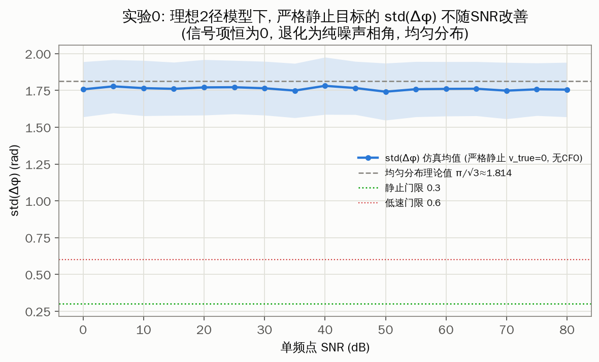
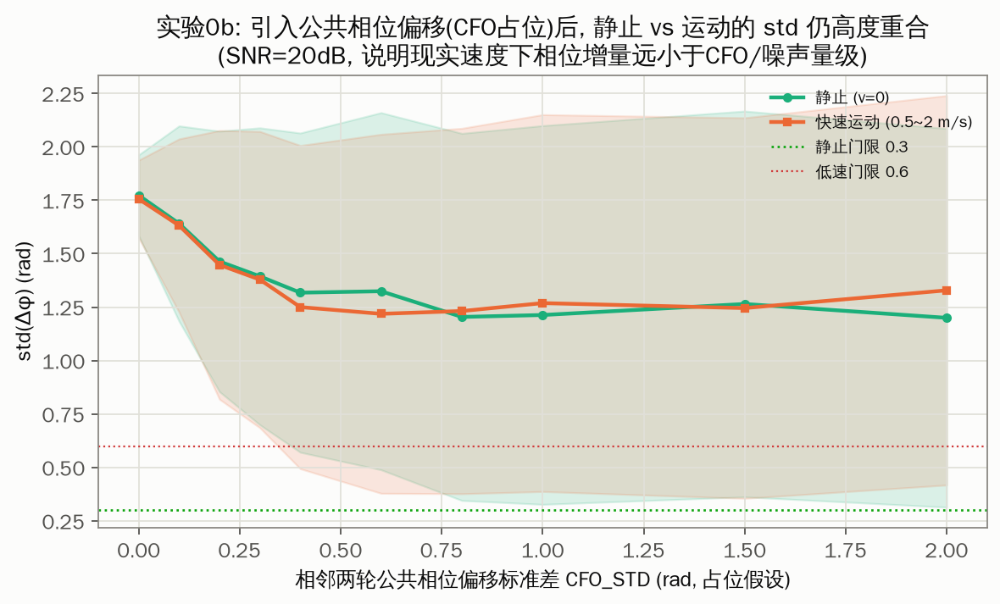

# 星闪测距速度卡限算法设计报告

| | |
|---|---|
| 文档状态 | 草稿 v0.1 (待实测数据补充与评审) |
| 适用范围 | 星闪(NearLink)/类蓝牙CS 相位测距(PBR)后处理 —— 速度卡限模块 |
| 关联模块 | 依赖上游"基线测距"模块输出的原始测距值 d_raw (本报告不涉及其实现) |

---

## 0. 阅读说明

本报告描述的算法(相位差 DFT 测速 + 两档标准差静止判据 + 限幅)为**现网已实现算法**,
本报告的目标是把其设计原理系统化地写清楚,并用仿真手段对其关键假设做定量核查。

仿真过程中发现: 在报告第 6 节所列的**占位系统参数**下,现网公式对"静止 vs 低速 vs
快速运动"三种状态的标准差判据**没有表现出预期的区分度**(该结论在第 6 节有完整推导
与仿真复现)。这不是要否定现有算法,而是明确指出: **该算法的有效性强依赖若干本报告
无法凭空假设的现网参数与真实信道特性**,必须用实测 IQ 数据来核实、标定。本报告已经把
所有这类参数、结论标注为"待实测数据确认",并给出了具体需要采集什么数据、怎么核对的
清单(见第 8 节)。

全文中出现的 **TODO(实测)** 标记均表示该数值/结论为仿真占位假设,需要用真实协议参数
或实测 IQ 数据替换/验证后才能作为最终设计依据。

---

## 1. 背景与目的

### 1.1 背景

星闪(NearLink)近场测距与蓝牙 Channel Sounding(CS)采用相似的相位测距(Phase-Based
Ranging, PBR)机制: 收发双方在一组频点(信道)上交换单音信号并记录 IQ 复采样,通过
IQ 相位随频点变化的斜率解算收发双方之间的飞行时间/距离。

相位测距对多径、噪声较为敏感,尤其当**设备处于静止状态**时,理想情况下连续多次测距
值应该保持平稳,但受噪声、多径时变、干扰等因素影响,原始测距值(d_raw)仍可能出现
"野值跳变"。为了在静止/低速场景下抑制这类不合理波动,现网引入了一个**基于相邻两次
测量相位差估计运动速度**的后处理模块,用速度信息反推"这段时间内测距值理应变化多少",
以此为测距输出设置动态限幅范围。

### 1.2 目的

本报告的目的是:

1. 系统化描述该速度卡限算法的信号模型、计算步骤与两档判据的设计原理;
2. 用仿真手段验证算法在给定参数下的行为,包括速度估计精度、标准差判据的区分能力、
   限幅前后测距轨迹的对比;
3. 明确指出仿真所依赖的假设参数,标注需要用实测数据替换/校准的位置;
4. 给出下一步实测验证计划。

### 1.3 不在本报告范围内的内容

- 基线测距算法(如何从单次测量的 IQ 得到原始测距值 d_raw)本身的设计与实现,本报告将
  其视为已有的黑盒上游模块;
- 星闪 CS 底层协议帧结构、频点跳变图样、同步与校准流程。

---

## 2. 术语与符号

| 符号 | 含义 |
|---|---|
| round / 测量轮 | 一次完整的多频点相位测距过程,产生一组 IQ(k), k=0..N_F-1 |
| N_F | 每轮测量使用的频点(信道)数 |
| Δf | 相邻频点间隔 (Hz) |
| Δt | 相邻两次测量(round n-1 与 round n)之间的时间间隔 (s) |
| K | 单程/双程系数: 单程测距取 1, 双程(收发双方各计一次相位)取 2 |
| d(n) | 第 n 轮测量时的真实(单程)距离 |
| θ(k,n) | 第 n 轮测量在频点 k 上的理论(无噪)相位 |
| IQ(k,n) | 第 n 轮测量在频点 k 上的复采样(含噪声/多径) |
| Δφ(k) | 相邻两轮在频点 k 上的相位差, 本报告中定义为 angle(IQ(k,n) − IQ(k,n−1)) |
| std(Δφ) | Δφ(k) 在 k=0..N_F−1 上的标准差 (rad) |
| v_hat | 由 Δφ(k) 关于频点 k 的 DFT 斜率拟合换算得到的速度估计 (m/s) |
| d_raw(n) | 基线测距模块给出的第 n 轮原始测距值 (m) |
| d_out(n) | 速度卡限后的第 n 轮测距输出值 (m) |

---

## 3. 算法总体框图

```
                    ┌─────────────────────┐
  IQ(k, n)          │   基线测距模块 (黑盒,  │        d_raw(n)
  IQ(k, n-1)  ─────▶│  本报告范围外, 现网已有)│───────────────┐
                    └─────────────────────┘                 │
                                                              ▼
  IQ(k, n)          ┌─────────────────────┐   v_hat(n)   ┌────────────────┐
  IQ(k, n-1)  ─────▶│  速度/标准差估计模块    │──────────▶│                 │
                    │  (本报告设计范围)       │  std(n)   │   两档限幅模块    │──▶ d_out(n)
                    │  Δφ(k)=angle(IQ2-IQ1) │──────────▶│  (本报告设计范围)  │
                    │  DFT斜率拟合 → v_hat   │           │                 │
                    │  std(Δφ) 计算          │           └────────────────┘
                    └─────────────────────┘                     ▲
                                                                  │
                                                       d_out(n-1) (状态反馈)
```

速度/标准差估计模块与限幅模块是本报告的设计范围;基线测距模块视为已有的上游黑盒。

---

## 4. 相位差与速度估计原理

### 4.1 单轮测量的理想相位模型

第 n 轮测量、第 k 个频点(频率 f_k = k·Δf)上的理想(无噪)相位为:

```
θ(k, n) = − 2π · K · f_k · d(n) / c
```

其中 c 为光速。同一轮内, θ(k,n) 关于频点 k 近似线性(相位斜率), 斜率与距离 d(n)
成正比 —— 这是基线测距模块(不在本报告范围)用来解算绝对距离的基本原理。

### 4.2 相邻两轮的相位差(现网实现)

现网实现方式为**复数直接相减后取相角**(已与需求方确认):

```
Δφ(k) = angle( IQ(k, n) − IQ(k, n−1) )
```

若两轮之间目标发生了位移 Δd = d(n) − d(n−1)(由速度 v 与测量间隔 Δt 决定,
Δd ≈ v·Δt),则相位增量为:

```
Δθ_motion(k) = θ(k,n) − θ(k,n−1) = − 2π · K · f_k · Δd / c
```

**设计意图**: Δθ_motion(k) 是关于频点 k 的线性函数,斜率正比于 Δd(进而正比于速度
v = Δd/Δt)。因此对 Δφ(k) 关于 k 做 DFT/IFFT 峰值搜索,理论上可以提取出这个线性斜率,
从而反解出 v_hat。设备静止(Δd≈0)时,v_hat 应接近 0;设备运动时,v_hat 应跟踪真实
速度,且相位差在各频点上的分散程度(std)应随速度增大而增大 —— 这正是两档静止判据
的设计初衷。

### 4.3 DFT 斜率提取的具体实现(本报告仿真所用方法)

```
s(k) = exp( j · Δφ(k) )                         # 由相位差重建单位复指数序列
S(m) = FFT( s(k), 补零至 N_FFT 点 )               # 沿频点索引 k 做 DFT
m*   = argmax_m |S(m)|                           # 取幅度谱峰值位置
slope_hat = 2π · (m*/N_FFT) / Δf     [rad/Hz]    # 换算为相位-频率斜率
Δd_hat    = − slope_hat · c / (2π·K)             # 换算为等效位移
v_hat     = Δd_hat / Δt                          # 换算为速度估计
```

该方法与仿真脚本 `sim/simulate_speed_gate.py` 中 `dft_slope_to_speed()` 完全一致。
**现网实际实现的峰值搜索/插值方法(是否加窗、是否做二次插值提高分辨率等)需要与研发
确认** —— TODO(实测/现网代码核对)。

### 4.4 已识别的关键数值特性(必须与现网实测数据核对)

对"复数直接相减取相角"公式做解析展开(设两轮幅度近似相等,A(k,n)≈A):

```
IQ2(k) − IQ1(k) = A·[exp(jθ2(k)) − exp(jθ1(k))]
                 = 2jA · sin(Δθ(k)/2) · exp( j·(θ1(k)+θ2(k))/2 )
```

由此:

```
angle(IQ2(k) − IQ1(k)) ≈ (θ1(k)+θ2(k))/2  ±  π/2   (符号取决于 sin(Δθ(k)/2) 的正负)
```

也就是说,**该公式提取到的并不是 Δθ(k) 本身,而是"两轮绝对相位的平均值"叠加一个
由 Δθ(k) 符号决定的 ±90° 跳变项**。这一数值特性带来两个直接推论,均已在第 6 节用
仿真复现验证:

1. **当 Δθ(k) 恰好为 0(严格静止、无任何硬件相位漂移)时**,上式中的信号项恒为 0,
   angle(IQ2−IQ1) 完全由两轮噪声差 n2(k)−n1(k) 决定。圆对称复高斯噪声的相角是**严格
   均匀分布**,std(Δφ) 恒等于理论值 π/√3 ≈ 1.814 rad,**与 SNR、绝对测距范围均无关**
   (见实验 0)。这与"静止 ⟹ std 低"的设计直觉相反。
2. **真实设备的运动/静止差异在 Δθ_motion(k) 上体现的幅度极小**: 以本报告占位参数
   (Δt=10ms, 20MHz 扫频带宽, K=2)计算, 即使 v=2m/s 的"快速运动", 相邻两轮在最高
   频点上的相位增量也只有约 0.017 rad 量级, 远小于典型接收机噪声或硬件本振/CFO
   相位漂移的量级。这意味着"低速 vs 静止 vs 快速运动"三档在 Δφ(k) 上产生的可分性
   信号本身就非常微弱(见实验 1、实验 2、实验 3)。

这两点合起来说明: **std(Δφ) 判据要真正对静止/运动敏感,必须依赖本报告理想两径模型
未覆盖的机制**——例如真实信道的丰富多径对微小位移的干涉敏感性、更大的有效积累时间
/扫频带宽、或是本振(CFO)相位噪声与目标运动信号的耦合方式与本报告假设不同。**这些
都需要用实测 IQ 数据反推、标定**,详见第 8 节实测验证计划。在实测数据到位前,本报告
第 6 节的仿真结论应被理解为"在给定占位参数下的一种可能行为",而非对现网算法有效性
的最终结论。

---

## 5. 稳定性判据: 相位差标准差

### 5.1 定义

对同一 round-pair 内 N_F 个频点的原始(未去趋势)相位差直接求标准差:

```
std(Δφ) = std_k( Δφ(k) ),  k = 0, 1, ..., N_F−1        [单位: rad]
```

（已与需求方确认: 对象是原始相位差,不做线性去趋势/残差化处理。）

### 5.2 两档判据(现网取值)

| 档位 | 判据条件 | 含义 | 限幅半宽度 |
|---|---|---|---|
| 档位1: 低速 | std(Δφ) < 0.6 rad | 判定为低速运动状态 | range = \|v_hat\| · Δt |
| 档位2: 静止 | std(Δφ) < 0.3 rad **或** \|v_hat\| < 0.1 m/s | 判定为静止状态 | range = 0.1 · \|v_hat\| · Δt |
| 否则 | — | 正常/快速运动状态 | 不限幅,直接输出 d_raw |

判据为"或"逻辑: 只要标准差很低,或者 DFT 测速本身给出的速度很小,都认为设备静止,
使用更紧的限幅(0.1 倍系数)。档位判断的优先级为: 先判静止(档位2),不满足再判低速
(档位1),否则不限幅。

### 5.3 两档阈值(0.6 / 0.3 / 0.1)的取值依据

现为工程经验值。本报告第 6.5 节的仿真在给定占位参数下对阈值做了扫描分析
(检出率/虚警率曲线),但**由于第 4.4 节指出的模型局限性,当前仿真无法给出这三个
阈值在真实系统中的最优取值**,需要用实测数据重新扫描标定 —— TODO(实测)。

---

## 6. 测距值限幅(卡限)算法

### 6.1 限幅逻辑

```
state(n)   = classify( std(n), v_hat(n) )                # 见 5.2 两档判据
range(n)   = |v_hat(n)| · Δt                              若 state = 低速
           = 0.1 · |v_hat(n)| · Δt                        若 state = 静止
           = None (不限幅)                                 若 state = 运动

若 range(n) 为 None:
    d_out(n) = d_raw(n)
否则:
    d_out(n) = clip( d_raw(n),  d_out(n−1) − range(n),  d_out(n−1) + range(n) )
```

即以**上一次限幅后的输出值** d_out(n−1) 为中心,按当前档位给出的动态半宽度做硬限幅
(clamp),而非直接丢弃超范围的测量或做加权融合(已与需求方确认使用限幅方式)。

### 6.2 边界与冷启动问题(待细化,标注为开放问题)

- **首轮无 d_out(n−1)**: 当前设计取 d_out(0) = d_raw(0)(无历史值可参考,不限幅)。
- **range(n) = 0 的退化情况**: 当 v_hat(n) 恰好为 0 时,尤其静止档(0.1 倍系数)下
  range 可能非常接近 0,导致后续测距值被"焊死"在 d_out(n−1),对真实的缓慢漂移不敏感。
  是否需要设置 range_min 下限保护,现网实现待确认 —— TODO(实测/现网代码核对)。
- **状态切换的瞬态响应**: 从静止转为运动时,由于限幅以上一次输出为中心,前几轮的
  d_out 会明显滞后于真实距离变化(见第 6.6 节实验 5 的过渡场景曲线),该滞后量级
  需要结合实际业务对响应时延的要求评估是否可接受。

---

## 7. 仿真验证

仿真脚本: `sim/simulate_speed_gate.py`(Python,依赖 numpy/matplotlib),完整实现了
第 4~6 节描述的信号模型与算法链路。运行方式见附录 A。所有图表已生成于
`sim/results/`。

> **仿真参数假设一览(均为占位值,需与现网协议/实测数据核对)**
>
> | 参数 | 占位值 | 说明 |
> |---|---|---|
> | N_F(频点数) | 21 | TODO(实测) |
> | Δf(频点间隔) | 1 MHz | TODO(实测),决定了 20MHz 的扫频总带宽 |
> | Δt(测量间隔) | 10 ms | TODO(实测),对第 4.4 节的结论影响很大 |
> | K(单程/双程系数) | 2(双程) | TODO(实测) |
> | 非模糊测距范围 d_unambig = c/(K·(N_F−1)·Δf) | 7.5 m | 由上面参数推出 |
> | 单频点 SNR | 10~30 dB(部分实验扫描到 80dB) | TODO(实测) |
> | 典型运动速度范围 | 静止 0; 低速 0.05~0.3 m/s; 快速 0.5~2 m/s | TODO(实测业务场景) |

### 7.1 实验0: 理想两径模型下,严格静止目标的 std(Δφ) 退化现象



**方法**: 目标严格静止(v_true=0,无 CFO/硬件相位漂移),扫描单频点 SNR 从 0 到
80dB,统计 std(Δφ) 的均值。

**结果**: std(Δφ) 始终维持在 1.75~1.77 rad 左右,与均匀分布理论值 π/√3≈1.814 rad
高度吻合,**且不随 SNR 提升而下降**。

**结论**: 第 4.4 节的解析推导在仿真中得到复现 —— 理想两径模型下,严格静止意味着
相位差信号项恒为 0,std(Δφ) 退化为纯噪声相角的均匀分布统计量,与接收机灵敏度、
测距距离都无关。真实系统若确实观测到静止时 std 偏低,说明现网信道中存在使"零信号"
假设不成立的机制(见 4.4 节讨论),需要用实测数据确认。

### 7.2 实验0b: 引入"公共相位偏移"(CFO占位)后的敏感性分析



**方法**: 在相邻两轮之间叠加一个随机的、对所有频点相同的"公共相位偏移"
(代表本振/时钟 CFO 在 Δt 内的相位漂移,幅度用标准差 CFO_STD 参数化,从 0 扫到
2 rad),对比"严格静止"与"快速运动(0.5~2m/s)"两组 std(Δφ) 的均值曲线。

**结果**: 无论 CFO_STD 取何值,静止组与运动组的 std(Δφ) 曲线几乎完全重合
(全程最大差距仅 0.13 rad)。

**结论**: 单纯引入一个与频点无关的公共相位漂移项,不足以让 std(Δφ) 对静止/运动
产生区分度 —— 根本原因是 4.4 节指出的: 在本报告占位的 Δt(10ms)与扫频带宽
(20MHz)下,真实运动导致的相位增量(约 0.017 rad 量级)比 CFO 扰动、比噪声本身
小了 1~2 个数量级,不足以主导 Δφ(k) 的形状。这提示: 若要让该判据生效,需要**更大
的有效积累(更大 Δt 或更宽扫频带宽)、更严格的 CFO 控制,或者存在本模型未包含的
多径干涉敏感性机制**——具体是哪一种,需要实测数据来判定。

### 7.3 实验1: 速度估计 v_hat 与标准差随真实速度的变化


**方法**: 真实速度 v_true 从 −2 到 2 m/s 扫描,SNR 分别取 10/20/30 dB,统计
DFT 斜率法速度估计 v_hat 与 std(Δφ) 的均值/离散范围。

**结果**: (a) v_hat 的估计值噪声幅度达到 ±4000 m/s 量级,与真实速度(±2m/s)完全
不相关 —— 这是因为 Δφ(k) 本身接近均匀随机相位,DFT 峰值搜索基本等价于在纯噪声谱
中随机选峰,估计结果不可用。(b) std(Δφ) 曲线在 −2~2 m/s 范围内几乎是一条平线
(≈1.75~1.8 rad),与两档阈值(0.3/0.6)相差甚远。

**结论**: 与实验0/0b 一致,在给定占位参数下,无论是 v_hat 还是 std(Δφ),都没有
表现出对真实速度的敏感性。

### 7.4 实验2: 三种运动状态下 std(Δφ) 分布(近场 vs 远场对比)


**方法**: 分别在"近场"(工作距离在非模糊测距范围内)和"远场"(跨越非模糊测距
范围)两种工作距离区间下,对静止/低速/快速运动三种状态各做 1000 次蒙特卡洛试验,
绘制 std(Δφ) 分布箱线图。

**结果**: 两种工作距离区间下,三种运动状态的 std(Δφ) 分布几乎完全重叠(中位数均
在 1.76 rad 附近),说明本次仿真中"非模糊测距范围"本身不是导致三态不可分的主因
(真正主因是实验0/0b/1 已定位的信号幅度不足问题)。

### 7.5 实验3: 两档判据分类性能(混淆矩阵 + 阈值扫描)


**方法**: (a) 用现网阈值(0.6/0.3/0.1)对三种真实状态做分类,统计混淆矩阵;
(b) 扫描静止档 std 阈值,统计"真实静止→判定为静止"的检出率与"真实快速运动→
判定为静止"的虚警率。

**结果**: (a) 在给定占位参数下,三种真实状态 100% 被判定为"运动"档,静止档、
低速档检出率均为 0%,限幅从未触发。(b) 阈值扫描显示,只有把 std 阈值放宽到 1.0
rad 以上,检出率才开始明显抬头,但此时虚警率也同步上升 —— 说明在当前假设参数下,
0.3/0.6 这两个阈值本身相对于 std(Δφ) 的实际分布(集中在 1.5~2.0 rad)明显偏小。

**结论**: 该结果本身不能直接说明现网阈值"不对",而是说明**仿真所用的占位参数
(尤其 Δt、扫频带宽、SNR)大概率与现网实际不符**,必须用实测数据重新标定 std(Δφ)
的真实分布,才能验证/调整这两个阈值。

### 7.6 实验4: 用当前(理想模型)估计的 v_hat/std 做限幅的效果


**方法**: 构造三种基线测距轨迹场景(静止叠加多径野值 / 恒速 0.3m/s 运动 / 静止→
运动→静止过渡),用本报告实现的 DFT 测速 + std 判据驱动限幅逻辑,对比限幅前后
(d_raw vs d_out)与真实距离(d_true)的轨迹。

**结果**: 三个场景下 d_out 与 d_raw 完全重合(RMSE、最大单步跳变量完全一致),
限幅从未生效 —— 与实验3 的混淆矩阵结果一致(分类器恒判"运动",不触发限幅)。

### 7.7 实验5: 理想(oracle)判据下限幅逻辑本身的效果


为了把"限幅逻辑本身是否有效"与"当前公式能否提供准确的 v_hat/std"这两个问题
解耦,本实验**直接使用真实速度 v_true**(而非实验4中由 IQ 估计出的 v_hat)驱动
同一套两档限幅逻辑,代表"上游速度/状态判据 100% 准确"的理想情况。

**结果**(RMSE 单位: m):

| 场景 | RMSE(d_raw, d_true) | RMSE(d_out, d_true) | 最大单步跳变(限幅前) | 最大单步跳变(限幅后) |
|---|---|---|---|---|
| 静止 + 多径野值 | 0.121 | **0.009** | 1.180 m | **0.004 m** |
| 恒速运动 0.3m/s | 0.203 | **0.064** | 1.646 m | **0.003 m** |
| 静止→运动→静止过渡 | 0.171 | **0.028** | 1.301 m | 0.069 m |

**结论**: 当速度/状态判据准确时,两档限幅逻辑能非常有效地抑制多径野值(静止场景
RMSE 降低约 13 倍,最大单步跳变从 1.18m 压到 4mm),同时仍能较好跟踪真实的匀速
运动(RMSE 降低约 3 倍),过渡场景也能以有限的响应滞后跟上状态切换。**这证明限幅
逻辑本身的设计是合理、有效的**;当前的瓶颈在于第 4.4/7.1~7.5 节指出的"如何在给定
现网参数下让 v_hat/std 准确反映真实运动状态",这必须依靠实测数据来解决(见第 8 节)。

---

## 8. 实测验证计划(待实测数据补充)

本节所有具体数值、图表均为**占位**,需要在拿到实测 IQ 数据后补充完整 —— 整节标注
TODO(实测)。

### 8.1 测试场景设计

| 场景 | 说明 | 数量建议 |
|---|---|---|
| 严格静止 | 设备固定于支架,记录 IQ 与对应的 d_raw 序列 | ≥10 组,不同绝对距离/环境 |
| 静止(带微动) | 设备置于人手持/桌面等有微小振动的场景 | ≥10 组 |
| 低速运动 | 0.05~0.3 m/s,匀速走动或滑轨匀速拖动 | ≥10 组,含不同方向(靠近/远离) |
| 快速运动 | 0.5~2 m/s | ≥10 组 |
| 静止↔运动切换 | 用于评估状态切换瞬态响应 | ≥5 组 |
| 不同信道环境 | 近距离 LOS、远距离 LOS、室内 NLOS/多径丰富环境 | 每种环境覆盖上述场景 |

### 8.2 需要采集的数据(TODO 实测)

- 每轮测量的原始 IQ(k,n) 复采样(全部 N_F 个频点),而不仅仅是最终测距值,用于
  离线复现 Δφ(k)、std(Δφ)、v_hat 的真实分布;
- 高精度 ground-truth 位置/速度参考(如光学动捕、编码器滑轨、RTK),用于标定
  v_true 与 std/v_hat 的真实映射关系;
- 现网实际使用的 N_F、Δf、Δt、K 等协议参数的确认值(替换第 7 节表格中的占位值);
- 现网实测的单频点 SNR / 信噪比范围,及典型多径环境下的信道相干时间估计。

### 8.3 待验证/标定的结论清单

1. 第 4.4 节推导的"静止退化为均匀分布 std"现象,在真实 IQ 数据中是否成立;若不
   成立,真实信道中主导 std 差异的机制是什么(多径干涉敏感性 / CFO / 其他)。
2. 第 7 节仿真中 Δt=10ms、20MHz 扫频带宽下运动信号过弱的问题,是否与现网真实
   Δt、扫频带宽相符;若相符,需要评估是否要调整 Δt 或扫频带宽以增强灵敏度。
3. 两档阈值(0.6 / 0.3 / 0.1)在真实 std(Δφ) 分布下的检出率/虚警率(参照实验3的
   分析方法,用实测数据重新绘制阈值扫描曲线)。
4. DFT 斜率法 v_hat 相对真实速度的估计偏差与噪声水平(参照实验1的分析方法)。
5. 限幅逻辑(第 6 节)在真实基线测距野值分布下的实际抑制效果(参照实验4/5的分析
   方法,用真实 d_raw 数据替换仿真中的野值模型)。
6. range_min 下限保护、冷启动、状态切换瞬态响应等第 6.2 节列出的边界问题的现网
   实际处理方式。

---

## 9. 风险与待确认事项汇总

| # | 事项 | 类型 | 影响 |
|---|---|---|---|
| 1 | N_F、Δf、Δt、K 的真实协议取值 | 参数确认 | 直接决定 v_hat/std 的有效性,见 7.6 节 |
| 2 | "复数直接相减取相角"公式在小信号下的数值特性(4.4节) | 设计原理 | 影响 std 判据的物理解释是否成立 |
| 3 | 真实信道中静止/运动 std 差异的主导机制(多径敏感性等) | 待验证假设 | 决定判据阈值标定方向 |
| 4 | 0.6/0.3/0.1 三个阈值的标定依据 | 参数标定 | 需要实测 std/v_hat 分布重新扫描 |
| 5 | DFT 峰值搜索的具体实现(加窗/插值等) | 实现细节确认 | 影响 v_hat 精度,需与现网代码核对 |
| 6 | range_min 下限保护是否存在 | 实现细节确认 | 影响静止档是否会"焊死"测距输出 |
| 7 | 冷启动(首轮无 d_out(n-1))处理方式 | 实现细节确认 | 影响上电初期输出行为 |
| 8 | 状态切换瞬态响应时延是否满足业务要求 | 待验证假设 | 见实验5过渡场景,需实测数据复核 |

---

## 附录 A: 仿真脚本运行说明

```bash
cd sim
python3 simulate_speed_gate.py
```

依赖: `numpy`, `matplotlib`(`pip install numpy matplotlib`)。

输出:
- `sim/results/exp0_static_degeneracy.png` ~ `exp5_oracle_gating.png`: 对应第 7 节各实验图;
- `sim/results/summary.json`: 全部实验的关键数值结果(均值、RMSE 等),供报告引用与后续复核对比。

脚本内所有可调参数集中在文件顶部"1. 仿真参数"一节,并逐一标注 `TODO(实测)`,
替换为现网真实参数后可直接重新运行,复现本报告全部图表。

## 附录 B: 核心公式速查

```
Δφ(k)      = angle( IQ(k,n) − IQ(k,n−1) )
std(Δφ)    = std_k( Δφ(k) )
v_hat      = DFT_slope( {Δφ(k)} ) 换算得到 (见 4.3 节)

state = 静止   若 std(Δφ) < 0.3  或  |v_hat| < 0.1
state = 低速   若 std(Δφ) < 0.6 (且不满足静止条件)
state = 运动   否则

range = |v_hat|·Δt        (低速档)
      = 0.1·|v_hat|·Δt    (静止档)

d_out(n) = clip( d_raw(n), d_out(n−1) − range, d_out(n−1) + range )   (低速/静止档)
d_out(n) = d_raw(n)                                                    (运动档)
```
